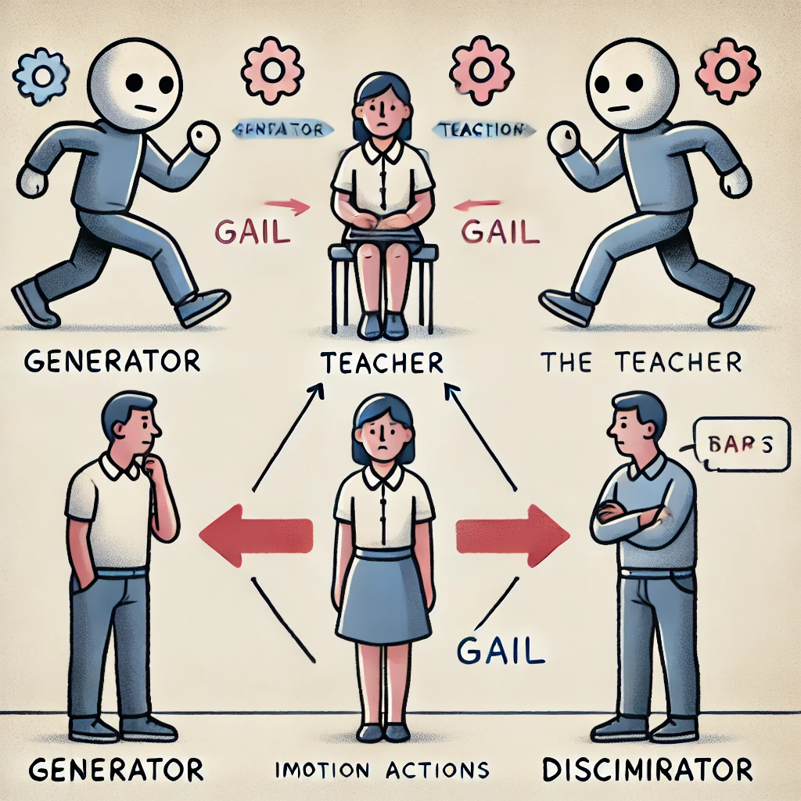

# 模倣学習

「模倣学習」は、教師となる人間の一連の行動（「デモ」と呼びます）を模倣することで、タスクを攻略する学習法です。報酬を得ることが難しいゲームでも、人間の行動を模倣することで、学習を早く進めることができます。

<br>

## 模倣学習の学習環境の準備

「4-6 Curiosity」で作成した学習環境で「模倣学習」を学習します

## デモの記録
### ①エージェントに「DemonstrationRecorder」

RecordをチェックしてUnityエディタを実行すると、「Demonstration Directory」でデモの保存先を指定できます。デフォルトでは「Assets/Demonstrations/」


|項目|説明|
|---|---|
|Record|デモファイルを保存するかどうか|
|Num Steps To Record|記録するステップ数(0は無制限)|
|Demonstration Name|デモファイル名|
|Demonstration Directory|デモファイルを保存するフォルダ(デフォルトは「Demonstrations/」)|

<br>

### ②「Unityエディタ」上で、ヒューリスティックモードで実行

### ③キー操作で５周回った後、Stopボタンで終了
「Assets/Demonstrations」に「ImitationEx.demo」が生成されています

### ④ProjectWindowで「ImitationEx.demo」を選択


## 模倣学習の学習設定ファイルの設定
今回は「PPO」で学習します。以下のように、ハイパーパラメータを設定
```yaml
behaviors:
  ImitationEx:
    trainer_type: ppo

    max_steps: 10000000
    time_horizon: 128
    summary_freq: 10000
    keep_checkpoints: 5

    hyperparameters:
      batch_size: 128
      buffer_size: 2048
      learning_rate: 0.0003
      learning_rate_schedule: linear

      beta: 0.01
      epsilon: 0.2
      lambd: 0.95
      num_epoch: 3

    network_settings:
      normalize: false
      hidden_units: 512
      num_layers: 2

    reward_signals:
      extrinsic:
        gamma: 0.99
        strength: 1.0

      curiosity:
        gamma: 0.99
        strength: 0.005
        network_settings:
          hidden_units: 64
        learning_rate: 0.0003

      gail:
        gamma: 0.99
        strength: 0.005
        network_settings:
          hidden_units: 64
        learning_rate: 0.0003
        use_actions: false
        use_vail: false
        demo_path: ./config/sample/ImitationEx.demo

    behavioral_cloning:
      demo_path: ./config/sample/ImitationEx.demo
      steps: 10000
      strength: 0.5
      samples_per_update: 0
```

### BCのハイパーパラメータ
「behavioral_cloning:」に、BCのパラメータを設定します

**`demo_path`**  
demoファイルのパス

**`strength`**


**`batch_size`**


**`num_eppoch`**


**`samples_per_update`**


### GAIL（模倣）報酬のハイパーパラメータ

**``**

**``**

**``**

**``**

**``**

**``**


**``**


## GANのGeneratorとDiscriminator
「GAIL」は、「GAN」(Generative Adversarial Network)の手法によって、模倣学習を行います。  
「GAN」では、「Generator」と「Discriminator」という２つのモデルを使います。  
「Generator」は「教師データ」と似たデータを生成しようとします
「Discriminator」は「データ」が「教師データ」か「Generatorが生成したデータ」かを識別しようとします。   
「Generator」と「Discriminator」の関係は、紙幣の偽造者と警察の関係によく例えられます。偽造者は本物の紙幣と似ている偽造紙幣を作ろうとし、警察は本物の紙幣と偽造紙幣を見分けようとします




## 模倣学習の実行
「」を実行します。デモファイルは、

```
mlagents-learn .\config\sample\ImitationEx.yaml --run-id=ImitationEx-1 --env=ImitationEx-1 --num-envs=8
```


## 模倣学習専用のグラフ

模倣学習の使用時には、「TensorBoad」で模倣学習専用のグラフも提供されます。

#### Pretraining Lossグラフ
「BC」の損失関数の平均を表すグラフです。モデルが新しい観察をどれだけうまく予測できるか示します。


#### GAIL Lossグラフ


#### GAIL Rewardグラフ


#### GAIL Policy Estimateグラフ


#### GAIL Value Estimateグラフ

ポリシーによって導き出された状態および行動に対するDiscriminatorの推定を表すグラフです


#### GAIL Expert Estimateグラフ

デモによって導き出された状態と行動のDiscriminatorの推定を表すグラフです。


<br>

## 模倣学習の「あり」と「なし」の比較

「模倣学習」の「あり」と「なし」を比較してみます。  
デモがある分、模倣学習「あり」の方が早く報酬を見つけることができることがわかります。今回の環境では模倣学習「なし」でも、時間をかけることで見つけることができています。


