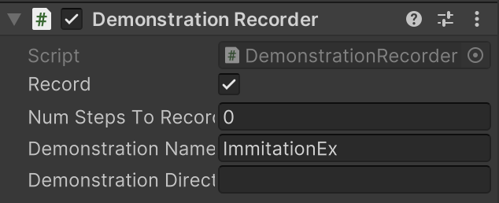
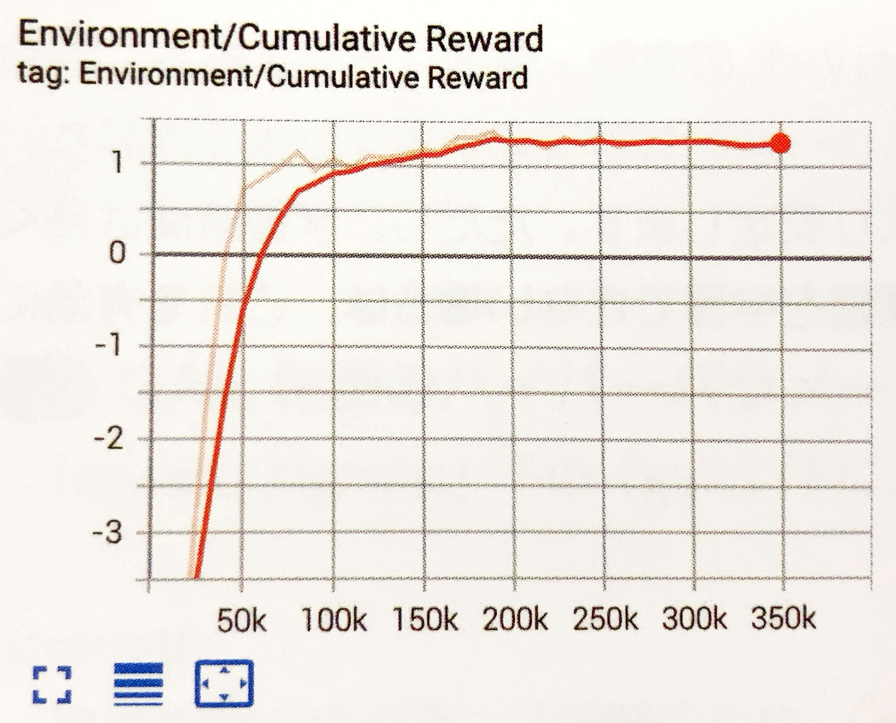
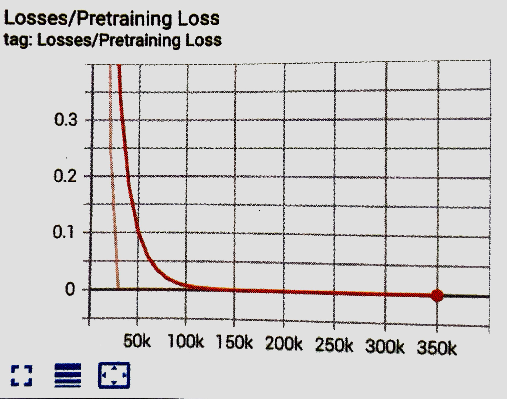
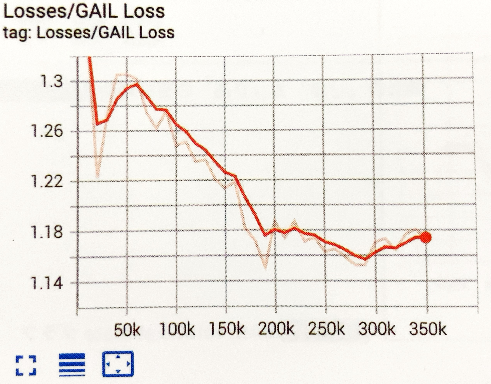
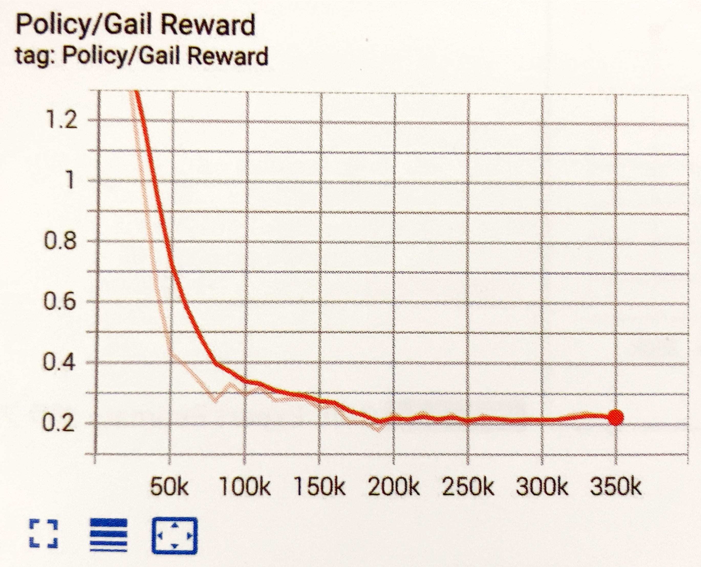
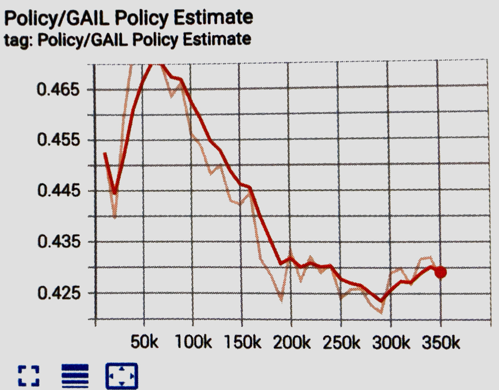
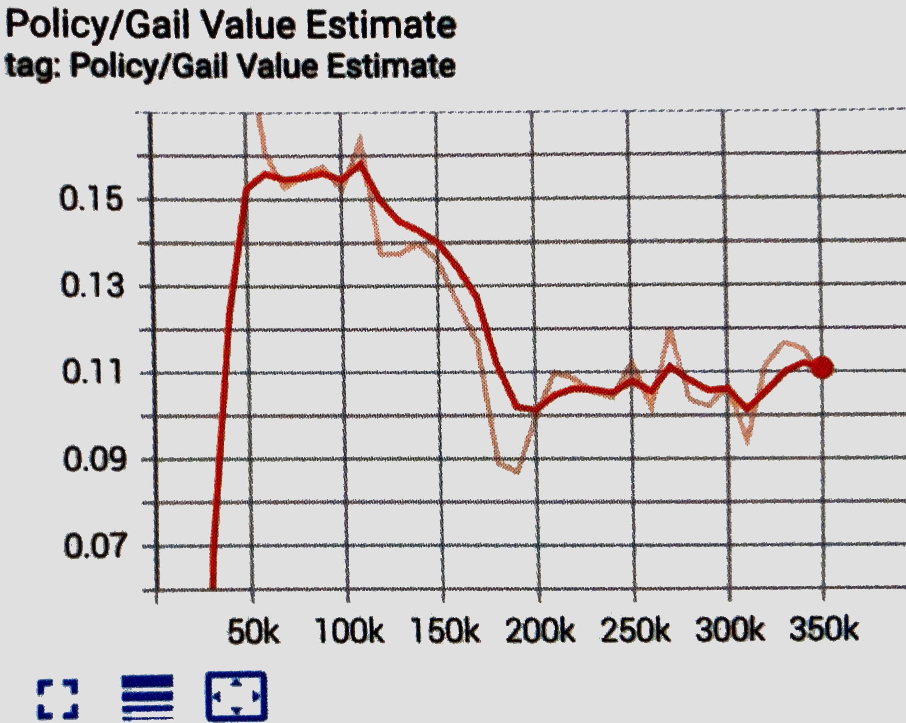
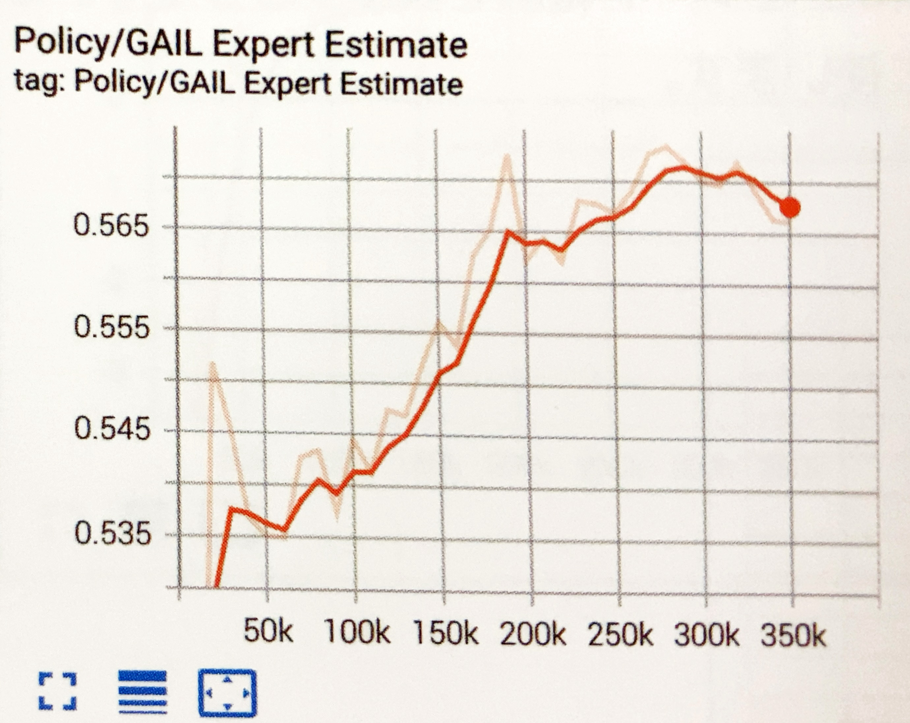

# 模倣学習

「模倣学習」は、教師となる人間の一連の行動（「デモ」と呼びます）を模倣することで、タスクを攻略する学習法です。報酬を得ることが難しいゲームでも、人間の行動を模倣することで、学習を早く進めることができます。

<br>

## 模倣学習の学習環境の準備

「4-6 Curiosity」で作成した学習環境で「模倣学習」を学習します

## デモの記録
### ①エージェントに「DemonstrationRecorder」

RecordをチェックしてUnityエディタを実行すると、「Demonstration Directory」でデモの保存先を指定できます。デフォルトでは「Assets/Demonstrations/」



|項目|説明|
|---|---|
|Record|デモファイルを保存するかどうか|
|Num Steps To Record|記録するステップ数(0は無制限)|
|Demonstration Name|デモファイル名|
|Demonstration Directory|デモファイルを保存するフォルダ(デフォルトは「Demonstrations/」)|

<br>

### ②「Unityエディタ」上で、ヒューリスティックモードで実行
「Behavior Parameters」にモデルが指定されている場合は、「Behavior Type」に「Heuristic Only」を指定してください。

### ③キー操作で５周回った後、Stopボタンで終了
「Assets/Demonstrations」に「ImitationEx.demo」が生成されています

### ④ProjectWindowで「ImitationEx.demo」を選択
Inspector Windowsにでもファイルの情報が表示されます。


<br>

## 模倣学習の学習設定ファイルの設定
今回は「PPO」で学習します。以下のように、ハイパーパラメータを設定
```yaml
behaviors:
  ImitationEx:
    trainer_type: ppo

    max_steps: 10000000
    time_horizon: 128
    summary_freq: 10000
    keep_checkpoints: 5

    hyperparameters:
      batch_size: 128
      buffer_size: 2048
      learning_rate: 0.0003
      learning_rate_schedule: linear

      beta: 0.01
      epsilon: 0.2
      lambd: 0.95
      num_epoch: 3

    network_settings:
      normalize: false
      hidden_units: 512
      num_layers: 2

    reward_signals:
      extrinsic:
        gamma: 0.99
        strength: 1.0

      curiosity:
        gamma: 0.99
        strength: 0.005
        network_settings:
          hidden_units: 64
        learning_rate: 0.0003

      gail:
        gamma: 0.99
        strength: 0.005
        network_settings:
          hidden_units: 64
        learning_rate: 0.0003
        use_actions: false
        use_vail: false
        demo_path: ./config/sample/ImitationEx.demo

    behavioral_cloning:
      demo_path: ./config/sample/ImitationEx.demo
      steps: 10000
      strength: 0.5
      samples_per_update: 0
```

<br>

### BCのハイパーパラメータ
「behavioral_cloning:」に、BCのパラメータを設定します

**`demo_path`**  
demoファイルのパス

**`strength`**  
PPOの学習に対する模倣学習の影響度（デフォルト：1.0）
```
・典型的な値：0.1 ~ 0.5
```

<br>


**`steps`**
模倣学習のステップ数（デフォルト：0）。
0は無期限。  
「BC」では、エージェントが報酬を発見した後、デモの使用を停止することが望ましい場合がよくあります。停止した後、強化学習で最適化することもできます。学習全体に渡って模倣学習を行うには、ステップを「０」に設定します

<br>

**`batch_size`**  
模倣学習のバッチサイズ（デフォルト：「hyperparameters」のbatch_size）
```
・典型的な値：Continuous：512 ~ 5120
・典型的な値：Discrete：32 ~ 512
```

<br>

**`num_epoch`**  
模倣学習のポリシー更新時の学習回数（デフォルト：「hyperparameters」のnum_epoch）。
```
・典型的な値：3 ~10
```

<br>

**`samples_per_update`**  
模倣学習のポリシー更新前に収集する経験数（デフォルト:0）。0はステップ毎。  
デモのデータセットが非常に大きい場合は、ポリシーの過剰適合を避けるために、これを下げることができます。「0」に設定すると、各更新ステップで全てのデモを利用します
```
・典型的な値：buffer_size
```

<br>

### GAIL（模倣）報酬のハイパーパラメータ
「reward_signals:」下の「gail:」下に、GAIL報酬のパラメータを設定します。

**`strength`**
環境報酬とのバランス調整のため、GAIL報酬に乗算する値（デフォルト：1.0）。デモが最適ではない場合は、この値を低く指定します。デモをコピーしたい場合は、大きな値を指定します。
```
・典型的な値：0.001 ~ 0.1
```

<br>

**`gamma`**
将来の報酬割引率(デフォルト：0.99)。将来の報酬を重視する場合は大きな値、即時報酬を終止する場合は小さな値にします。  
```
・典型的な値：0.8 ~ 0.995
```
<br>


**`demo_path`**  
demoファイルのパス

<br>


**`network_settings`**
GAILモデルのニューラルネットワークの設定。  
設定項目は、「network_settings」と同様です。「hidden_units」は元の観測を圧縮するように十分に小さくする必要がありますが、期待される観察と実際の観察を区別できるだけの大きさ（64 ~ 256）が必要です。

<br>


**`learning_rate`**
GAILモデルの学習率（デフォルト：3e-4）。
学習が不安定で、GAILの損失が不安定な場合、これらを減らす必要があります。
```
・典型的な値：1e-5 ~ 1e-3
```


<br>


**`use_actions`**
Determineが観察と行動の両方と、観察のみの、どちらに基づいて区別するか（デフォルト：false）  
エージェントにでもの行動を模倣させたい場合は、trueに設定します。falseに設定すると、デモが不完全な場合に安定する可能性が高くなりますが、学習速度が遅くなる可能性があります。


<br>


**`use_vail`**
Determineのvariational bottleneckの有効・無効（デフォルト：false）  
これにより、Discriminatorはより一般的な表現を学習するようになり、識別が「あまりにも良い」傾向が減り、学習がより安定します。  
ただし、学習時間は長くなります。模倣学習が不安定であるが、手元の課題を学習できない場合は、これを有効にします。

<br>


## GANのGeneratorとDiscriminator
「GAIL」は、「GAN」(Generative Adversarial Network)の手法によって、模倣学習を行います。   
　模倣学習を簡単に説明すると、「人がやっていることを真似して学ぶ」方法です。  

「GAN」では、「Generator（生成者・生成器）」と「Discriminator（判定者・識別器）」という２つのモデルを使います。  
「Generator」は「教師データ」と似たデータを生成しようとします
「Discriminator」は「データ」が「教師データ」か「Generatorが生成したデータ」かを識別しようとします。   

「Generator」と「Discriminator」の関係は、紙幣の偽造者と警察の関係によく例えられます。偽造者は本物の紙幣と似ている偽造紙幣を作ろうとし、警察は本物の紙幣と偽造紙幣を見分けようとします


<br>

## 模倣学習の実行
「模倣学習」を実行します。デモファイルは、学習設定ファイルで指定したパス（./config/sample/ImitationEx.demo）に配置してください

```
mlagents-learn .\config\sample\ImitationEx.yaml --run-id=ImitationEx-1 --env=ImitationEx-1 --num-envs=8
```

学習結果のグラフは、次のとおりです。



<br>

## 模倣学習専用のグラフ

模倣学習の使用時には、「TensorBoad」で模倣学習専用のグラフも提供されます。

<br>

### Pretraining Lossグラフ
「BC」の損失関数の平均を表すグラフです。モデルが新しい観察をどれだけうまく予測できるか示します。



<br>

### GAIL Lossグラフ

「GAIL」の損失学習の平均を表すグラフです。モデルが新しい観察をどれだけうまく予測できるか示します。



<br>

### GAIL Rewardグラフ

報酬シグナル「GAIL」の平均累積エピソード報酬を表すグラフです。他の報酬シグナルとバランスを確認するために使います。



<br>

### GAIL Policy Estimateグラフ

GAIL報酬に対するエージェントの価値の見積もりを表すグラフです。



<br>

### GAIL Value Estimateグラフ

ポリシーによって導き出された状態および行動に対するDiscriminatorの推定を表すグラフです



<br>

### GAIL Expert Estimateグラフ

デモによって導き出された状態と行動のDiscriminatorの推定を表すグラフです。



<br>

## 模倣学習の「あり」と「なし」の比較

「模倣学習」の「あり」と「なし」を比較してみます。  
デモがある分、模倣学習「あり」の方が早く報酬を見つけることができることがわかります。今回の環境では模倣学習「なし」でも、時間をかけることで見つけることができています。


