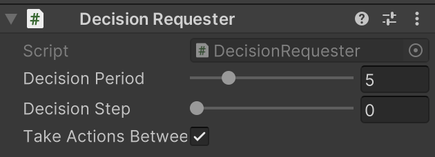
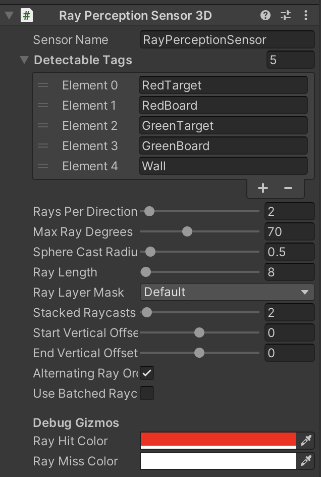
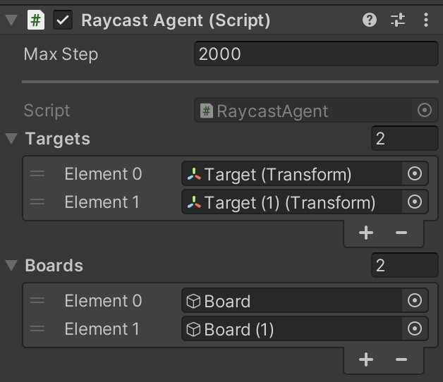

# LSTM(Long Short-Term Memory)

「LSTM」(Long Short-Term Memory)は、時系列を扱えるニューラルネットワークです。強化学習では、通常「現在の環境」の観察に応じて「エージェント」が「行動」を決定しますが、「LSTM」を利用することで環境の過去の観察も「行動」決定の判断材料に使えます。つまり、「エージェント」に「記憶」を持たせることができるようになります。  
「LSTM」はContinuousではうまく機能しません。より良い結果を得るには、「Discrete」を使用してください。

# LSTMの学習環境の準備

「4-4 RaycastObservation」で作成した学習環境をカスタマイズして、ボードと同じ色のターゲットまで移動することを学ぶ学習環境を作成し、「LSTM」で学習します。  
ターゲットを見ている時はボードが見えないため、「LSTM」でボードの色を覚えないと、報酬が増えない環境になっています。


<br>

今回の学習環境の強化学習の要素は、次のとおりです。

|項目|説明|
|---|---|
|観察|・Vector Observation(サイズ2)<br>0:RollerAgentのX速度<br>1:RollerAgentのZ速度<br>・Raycast Observation(スタック2)|
|行動|・Discrete(サイズ1)<br>0:移動(0:なし,1:前進,2:後進,3:左回転,4:右回転)|
|報酬|・ステップ毎:-0.0005<br>・ボードの色と同じ色のターゲットに到達した時に +1.0(エピソード完了)<br>・ボードの色と違う色のターゲットに到達した時に -0.2(エピソード完了)|
|決定|・5ステップ毎|

<br>

# RaycastAgentの設定

① 「Behavior Parameters」の「Behavor Name」を設定

② 「DecisionRequester」を設定



③ 「RayPerceptionSensor3D」を設定



④ スクリプト「RaycastAgent.cs」を編集

`RaycastAgent.cs`
```cs
using System.Collections.Generic;
using UnityEngine;
using Unity.MLAgents;
using Unity.MLAgents.Sensors;
using Unity.MLAgents.Actuators;
using Unity.MLAgents.Policies;

// RaycastAgent
public class RaycastAgent : Agent
{
    public Transform[] targets;
    public GameObject[] boards;
    Rigidbody rBody;
    int boardId;

    // ゲームオブジェクト生成時に呼ばれる
    public override void Initialize()
    {
        this.rBody = GetComponent<Rigidbody>();
    }

    // エピソード開始時に呼ばれる
    public override void OnEpisodeBegin()
    {
        // RaycastAgentの位置と速度をリセット
        this.rBody.angularVelocity = Vector3.zero;
        this.rBody.velocity = Vector3.zero;
        this.transform.localPosition = new Vector3(0.0f, 0.5f, -5.5f);
        this.transform.rotation = Quaternion.Euler(0f, 0f, 0f);

        // Boardのリセット
        this.boardId = Random.Range(0, 2);
        this.boards[0].SetActive(boardId == 0);
        this.boards[1].SetActive(boardId == 1);
        if (Random.Range(0, 2) == 0)
        {
            this.targets[0].localPosition = new Vector3(-3f, 0.5f, 5f);
            this.targets[1].localPosition = new Vector3(3f, 0.5f, 5f);
        }
        else
        {
            this.targets[0].localPosition = new Vector3(3f, 0.5f, 5f);
            this.targets[1].localPosition = new Vector3(-3f, 0.5f, 5f);
        }
    }

    // 行動実行時に呼ばれる
    public override void OnActionReceived(ActionBuffers actionBuffers)
    {
        // RaycastAgentに力を加える
        Vector3 dirToGo = Vector3.zero;
        Vector3 rotateDir = Vector3.zero;
        int action = actionBuffers.DiscreteActions[0];
        if (action == 1) dirToGo = transform.forward;
        if (action == 2) dirToGo = transform.forward * -1.0f;
        if (action == 3) rotateDir = transform.up * -1.0f;
        if (action == 4) rotateDir = transform.up;
        this.transform.Rotate(rotateDir, Time.deltaTime * 200f);
        this.rBody.AddForce(dirToGo * 0.4f, ForceMode.VelocityChange);

        // マイナス報酬
        AddReward(-0.0005f);

        // RaycastAgentがTargetの位置に到着
        for (int i = 0; i < 2; i++)
        {
            float distanceToTarget = Vector3.Distance(
                this.transform.localPosition, targets[i].localPosition);
            if (distanceToTarget < 1.42f)
            {
                if (i == boardId)
                {
                    SetReward(1f);
                }
                else
                {
                    SetReward(-0.2f);
                }
                EndEpisode();
            }
        }
    }

    // ヒューリスティックモードで行動決定時に呼ばれる
    public override void Heuristic(in ActionBuffers actionBuffers)
    {
        var actionsOut = actionBuffers.DiscreteActions;
        actionsOut[0] = 0;
        if (Input.GetKey(KeyCode.UpArrow)) actionsOut[0] = 1;
        if (Input.GetKey(KeyCode.DownArrow)) actionsOut[0] = 2;
        if (Input.GetKey(KeyCode.LeftArrow)) actionsOut[0] = 3;
        if (Input.GetKey(KeyCode.RightArrow)) actionsOut[0] = 4;
    }
}
```

⑤ 「RaycastAgent」  
TargetsとBoardsにElementの設定。



<br>

# LSTMの学習設定ファイルの設定
今回は「PPO」で学習します。
以下のように、ハイパーパラメータを設定してください。

`LstmEx.yaml`
```yaml
behaviors:
  LstmEx:
    trainer_type: ppo

    max_steps: 10000000
    time_horizon: 64
    summary_freq: 10000
    keep_checkpoints: 5

    hyperparameters:
      batch_size: 128
      buffer_size: 1024
      learning_rate: 0.0003
      learning_rate_schedule: linear

      beta: 0.005
      epsilon: 0.2
      lambd: 0.95
      num_epoch: 3

    network_settings:
      normalize: false
      hidden_units: 128
      num_layers: 2

      memory:
        sequence_length: 128
        memory_size: 256

    reward_signals:
      extrinsic:
        gamma: 0.99
        strength: 1.0

```


# LSTMのハイパーパラメータ
「network_settings:」下の「memory:」下に。LSTMのパラメータを設定します

**`memory_size`**  
LSTMのメモリサイズ（デフォルト：128）。  
この値は２の倍数である必要があり、エージェントが記憶する必要があると予想される情報量に応じて、サイズ調整する必要があります。大き過ぎると学習が遅くなります。

```
典型的な範囲:32 ~ 256
```

<br>

**`sequence_length`**  
学習中にネットワークを通過するシーケンス長（デフォルト:64）。 エージェントが時間と共に必要がある情報をキャプチャするのに、十分な長さである必要があります。例えば、エージェントがオブジェクトの速度を記憶する場合は小さな値で済み、エージェントがエピソードの最初に1度だけ与えられた情報を記憶する場合は大きな値が必要になります。 

```
典型的な範囲:4 ~ 128
```
<br>

# LSTMの学習の実行

```
mlagents-learn .\config\sample\LstmEx.yaml --run-id=LstmEx-1 --env=LstmEx --num-envs=8
```
学習結果のグラフは、次のとおりです。350Kステップで学習できています。LSTMを使わないと、ゴールすべきターゲットの判断基準がわからないため、収束しません。


