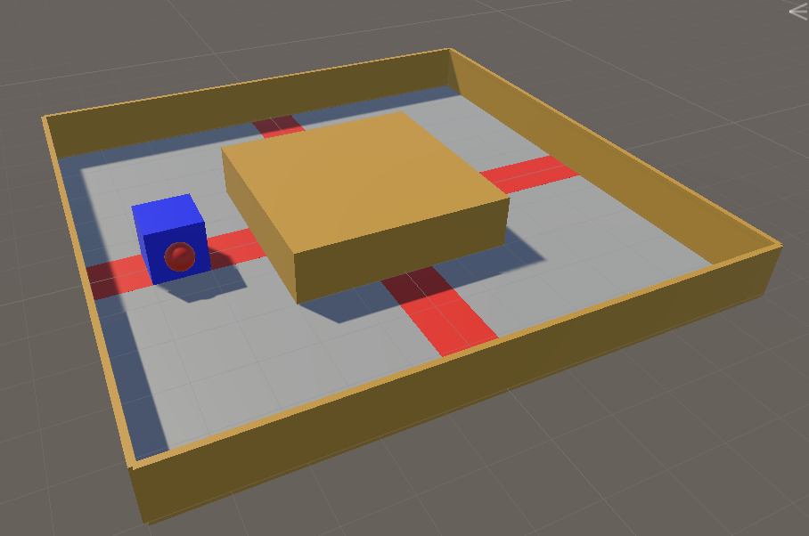
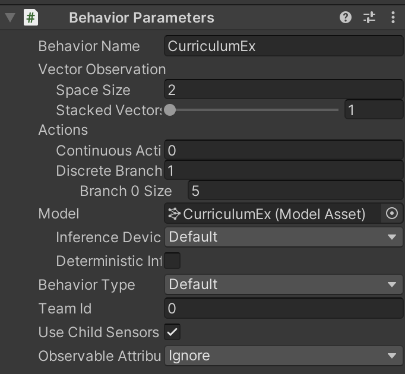
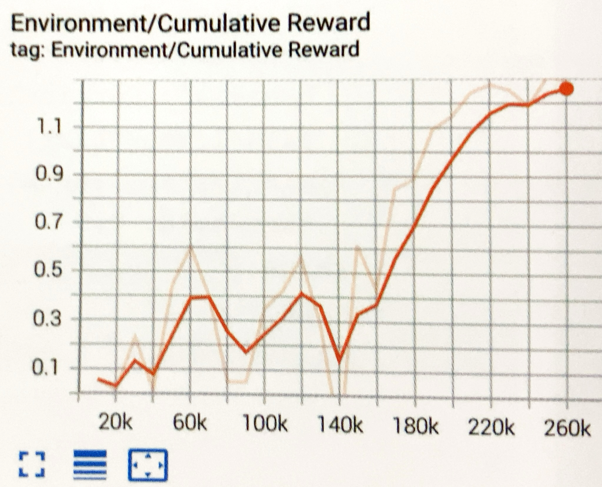
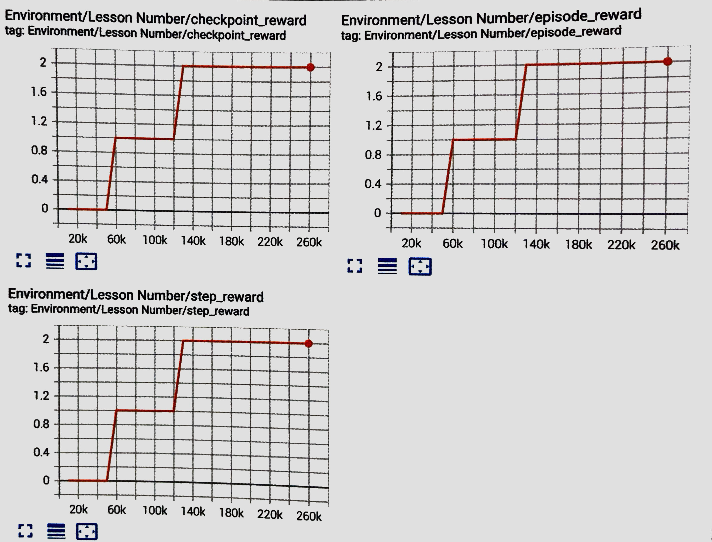
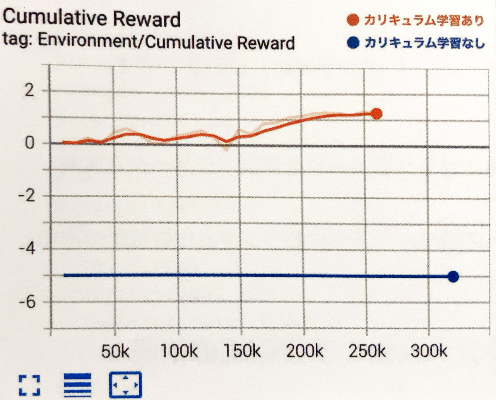

# 4-9 カリキュラム学習

「カリキュラム学習」はタスクの難易度を徐々に上げていくことで、より難しいタスクの攻略を可能にする学習方法です。

<br>

## カリキュラム学習とは

小学生の頃の授業を思い出してください。算数では「足し算・引き算」を教えた後、「掛け算・割り算」を教え、その後に「面積の計算」を教えます。レッスンで学んだ知識を、後のレッスンのための足場とすることで、より難しい問題を解くことを可能にしています。  
これと同じ原理を「強化学習」に適用します。


<br>

## カリキュラム学習の実装手順
「カリキュラム学習」の実装手順は、次の２つです。

#### ①カリキュラムに応じて変化するパラメーターを「環境パラメータ」で実装

#### ②学習設定ファイルへのカリキュラム学習の設定の追加

<br>

## カリキュラム学習の学習環境の準備
「4-6 Curiosity」で作成した学習環境をカスタマイズして「カリキュラム学習」を行います。  
「Behaviour Paramaters」を以下のように変更してください。






<br>

## 「環境パラメータ」の準備

今回は、以下の３つの変数を「環境パラメータ」として定義します。
```
・checkpointReward:チェックポイント通過時の報酬
・episodeReward:１周した時の報酬
・stepReward:ステップ毎のペナルティ
```
レッスンは全部で３つです。

#### レッスン０
コースを反時計回りに回ることを覚えさせます。チェックポイント通過時の報酬のみを与えます
```
・checkpointReward:0.2
・episodeReward:0.0
・stepReward:0.0
```

#### レッスン１
コースを１周することを覚えさせます。
１周した時の報酬のみを与えます。
```
・checkpointReward:0.0
・episodeReward:1.0
・stepReward:0.0
```

#### レッスン2
コースをできるだけ早く１周することを覚えさせます。１周した時の報酬とは別に、１ステップ毎のマイナス報酬も与えます
```
・checkpointReward:0.0
・episodeReward:2.0
・stepReward:-0.001
```


<br>

<br>

## 環境パラメータの実装

「RaycastAgent.cs」全体

```cs
using System.Collections.Generic;
using UnityEngine;
using Unity.MLAgents;
using Unity.MLAgents.Sensors;
using Unity.MLAgents.Actuators;
using Unity.MLAgents.Policies;

// RaycastAgent
public class RaycastAgent : Agent
{
    Rigidbody rBody;
    int lastCheckPoint; // 最終チェックポイント
    int checkPointCount; // チェックポイント通過数

    // ゲームオブジェクト生成時に呼ばれる
    public override void Initialize()
    {
        this.rBody = GetComponent<Rigidbody>();
    }

    // 環境パラメータ
    float checkPointReward;
    float episodeReward;
    float stepReward;

    // エピソード開始時に呼ばれる
    public override void OnEpisodeBegin()
    {
        // 周回数の環境
        this.lastCheckPoint = 0;
        this.checkPointCount = 0;

        // 環境パラメータの設定
        EnvironmentParameters envParams = Academy.Instance.EnvironmentParameters;
        this.checkPointReward = envParams.GetWithDefault("checkpoint_reward", 0.0f);
        this.episodeReward = envParams.GetWithDefault("episode_reward", 2.0f);
        this.stepReward = envParams.GetWithDefault("step_reward", -0.001f);
    }

    // 状態取得時に呼ばれる
    public override void CollectObservations(VectorSensor sensor)
    {
        sensor.AddObservation(rBody.velocity.x); // RaycastAgentのX速度
        sensor.AddObservation(rBody.velocity.z); // RaycastAgentのZ速度
    }

    // 行動実行時に呼ばれる
    public override void OnActionReceived(ActionBuffers actionBuffers)
    {
        // RaycastAgentに力を加える
        Vector3 dirToGo = Vector3.zero;
        Vector3 rotateDir = Vector3.zero;
        int action = actionBuffers.DiscreteActions[0];
        if (action == 1) dirToGo = transform.forward;
        if (action == 2) dirToGo = transform.forward * -1.0f;
        if (action == 3) rotateDir = transform.up * -1.0f;
        if (action == 4) rotateDir = transform.up;
        this.transform.Rotate(rotateDir, Time.deltaTime * 200f);
        this.rBody.AddForce(dirToGo * 0.4f, ForceMode.VelocityChange);

        // ステップ毎の報酬
        AddReward(this.stepReward);
    }

    // チェックポイントに衝突時に呼ばれる
    public void EnterCheckPoint(int checkPoint)
    {
        // 次のチェックポイントに衝突
        if (checkPoint == (this.lastCheckPoint+1)%4)
        {
            // チェックポイント毎のプラス報酬
            AddReward(this.checkPointReward);
            this.checkPointCount++;

            // ゴール
            if (this.checkPointCount >= 4)
            {
                // エピソード毎の報酬
                AddReward(this.episodeReward);
                EndEpisode();
            }
        }
        // 前のチェックポイントに衝突
        else if (checkPoint == (this.lastCheckPoint-1+4)%4)
        {
            // チェックポイント毎の・マイナス報酬
            AddReward(-this.checkPointReward);
            this.checkPointCount--;
        }

        // 最終チェックポイントの更新
        this.lastCheckPoint = checkPoint;
    }

    // ヒューリスティックモードの行動決定時に呼ばれる
    public override void Heuristic(in ActionBuffers actionBuffers)
    {
        var actionsOut = actionBuffers.DiscreteActions;
        actionsOut[0] = 0;
        if (Input.GetKey(KeyCode.UpArrow)) actionsOut[0] = 1;
        if (Input.GetKey(KeyCode.DownArrow)) actionsOut[0] = 2;
        if (Input.GetKey(KeyCode.LeftArrow)) actionsOut[0] = 3;
        if (Input.GetKey(KeyCode.RightArrow)) actionsOut[0] = 4;
    }
}

```


<br>


## 「環境パラメータ」の実装

「環境パラメータ」は環境開始時に設定するパラメータです。カリキュラムに応じて、このパラメータが変化するように実装します。

#### ① 環境パラメータの変数の準備

```cs
    // 環境パラメータ
    float checkPointReward;//チェックポイント通過時の報酬
    float episodeReward;//１周した時の報酬
    float stepReward;//ステップ毎のペナルティ
```

#### ② OnEpisodeBegin()で環境パラメータの値を設定
環境パラメータは、「Academy.Instance.EnviromentParameters」のGetWithDefault()で取得します。

> float GetWithDefault(string key , float defaultValue)  
> 説明：環境パラメータの値の取得   
> 引数：key  キー
>      defaultValue　初期値  
> 戻り値：環境パラメータの値


```cs
// 環境パラメータの設定
        EnvironmentParameters envParams = Academy.Instance.EnvironmentParameters;
        this.checkPointReward = envParams.GetWithDefault("checkpoint_reward", 0.0f);
        this.episodeReward = envParams.GetWithDefault("episode_reward", 2.0f);
        this.stepReward = envParams.GetWithDefault("step_reward", -0.001f);
```

どんな値で学習するかは、カリキュラム学習の学習設定ファイルで設定します。

<br>

#### ③ 環境パラメータの利用
チェックポイント通過時の報酬に「checkPointReward」を利用します
```cs
// チェックポイント毎のプラス報酬
AddReward(this.checkPointReward);
this.checkPointCount++;
```
```cs
// チェックポイント毎のマイナス報酬
AddReward(this.checkPointReward);
this.checkPointCount--;
```


１周した時の報酬に「episodeReward」を使います
```cs
// エピソード毎の報酬
AddReward(this.episodeReward);
EndEpisode();
```

ステップ毎のペナルティに「stepReward」を使います
```cs
// ステップ毎の報酬
AddReward(this.stepReward);
```

<br>

## カリキュラム学習の学習設定ファイルの設定

今回は「PPO」で学習します。以下のようにハイパーパラメータを設定してください。

```yaml 
behaviors:
  CurriculumEx:
  #トレーナー種別
    trainer_type: ppo
  #基本
    max_steps: 10000000
    time_horizon: 128
    summary_freq: 10000
    keep_checkpoints: 5
    　
  #学習アルゴリズム
    hyperparameters:
    #PPOとSAC共通
      batch_size: 128
      buffer_size: 2048
      learning_rate: 0.0003
      learning_rate_schedule: linear
    #PPO用
      beta: 0.01
      epsilon: 0.2
      lambd: 0.95
      num_epoch: 3

    #ニューラルネットワーク
    network_settings:
      normalize: false
      hidden_units: 512
      num_layers: 2

    #報酬
    reward_signals:
      #環境報酬
      extrinsic:
        gamma: 0.99
        strength: 1.0

#環境パラメータ
environment_parameters:
  #チェックポイント報酬
  checkpoint_reward:
    curriculum:
      - name: Lesson0
        completion_criteria:
          measure: reward
          behavior: CurriculumEx
          signal_smoothing: true
          min_lesson_length: 10
          threshold: 0.7
        value: 0.3
      - name: Lesson1
        completion_criteria:
          measure: reward
          behavior: CurriculumEx
          signal_smoothing: true
          min_lesson_length: 10
          threshold: 0.9
        value: 0.0
      - name: Lesson2
        value: 0.0

  #エピソード報酬
  episode_reward:
    curriculum:
      - name: Lesson0
        completion_criteria:
          measure: reward
          behavior: CurriculumEx
          signal_smoothing: true
          min_lesson_length: 10
          threshold: 0.7
        value: 0.0
      - name: Lesson1
        completion_criteria:
          measure: reward
          behavior: CurriculumEx
          signal_smoothing: true
          min_lesson_length: 10
          threshold: 0.9
        value: 1.0
      - name: Lesson2
        value: 2.0
  
  #ステップ報酬
  step_reward:
    curriculum:
      - name: Lesson0
        completion_criteria:
          measure: reward
          behavior: CurriculumEx
          signal_smoothing: true
          min_lesson_length: 10
          threshold: 0.7
        value: 0.0
      - name: Lesson1
        completion_criteria:
          measure: reward
          behavior: CurriculumEx
          signal_smoothing: true
          min_lesson_length: 10
          threshold: 0.9
        value: 0.0
      - name: Lesson2
        value: -0.001

```


### カリキュラム学習のハイパーパラメータ
「environment_parameters:」の直下に「環境パラメータ」を並べ、「currilulum:」の下にレッスン情報を並べます。

```yaml
environment_parameters:
  checkpoint_reward:
    curriculum:
      - name: Lesson0
        completion_criteria:
          <次のレッスンに進む条件>
        value:<値>  
```

次のレッスンに進む条件は、以下の情報を持ちます。

```
・measure:レッスンの進捗条件の測定方法
　　・reward:エピソード報酬
　　・progress:ステップ数÷最大ステップ数
・behavior:対象となるBehavior
・signal_smoothing:シグナルのスムージング（true/false）
・min_lesson_length:閾値を何エピソード越えた時、次のレッスンに進むか
　　・threshold:閾値
```


<br>

## カリキュラム学習の実行
```
mlagents-learn .\config\sample\CurriculumEx.yaml --run-id=CurriculumEx-1
```
学習結果のグラフは、次のとおりです。



<br>

## カリキュラム学習専用のグラフ

カリキュラム学習の使用時には、「TensorBoard」でカリキュラム学習専用のグラフも提供されます。

#### Lesson Numberグラフ

環境パラメータ毎のレッスンの進捗状況を示すグラフです。



<br>

## カリキュラム学習の「あり」と「なし」の比較

「カリキュラム学習」の「あり」と「なし」を比較してみます。  
「カリキュラム学習」なしは、最初から「レッスン2」のパラメータのみで学習しました。    
学習結果のグラフは、次のとおりです。難易度の高い「レッスン2」から始めてしまうと、まったく報酬が見つけられないことがわかります。


