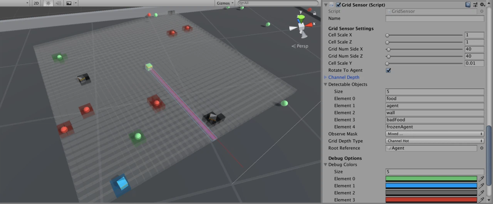
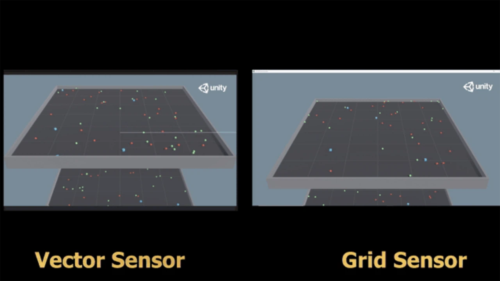
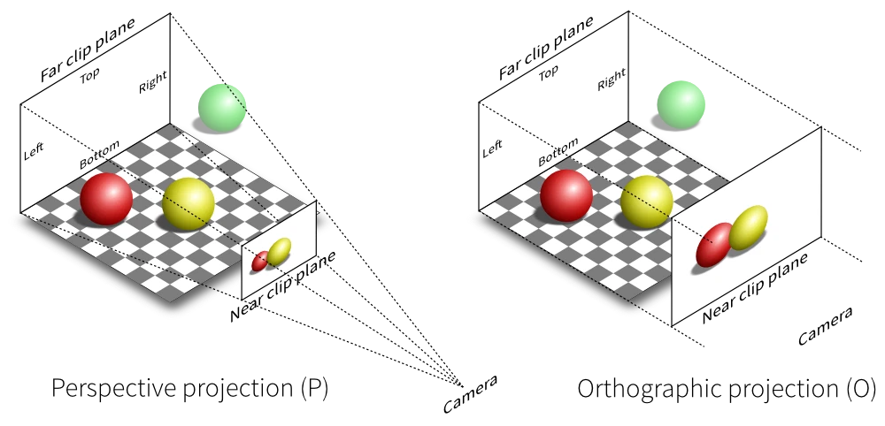
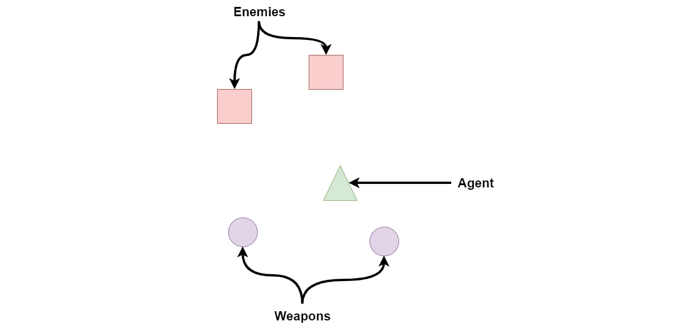
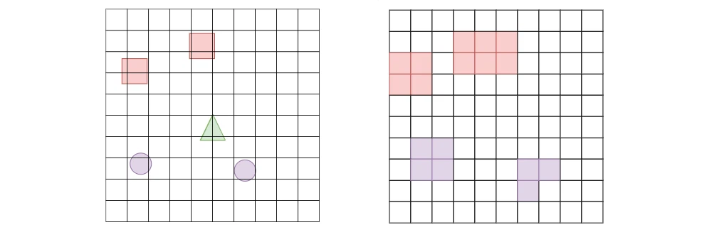

# 1. グリッドセンサー
「グリッドセンサー」は、レイキャストからのデータ抽出の一般性と、CNNの画像処理能力を組み合わせたものです。  
「幅×高さ×チャネル」マトリックス形式でデータを収集ことができ、強化学習エージェントの学習やデータ分析に使用することができます。



<br>

# 2. 動機
「Unity ML-Agents」には、エージェント周囲のオブジェクトを観察するための主要センサーが2つあります。

<br>

### ◎ レイキャスト
「レイキャスト」は、LiDARと同様に事前に指定した視線に沿ってオブジェクトを観察します。これは実装が簡単で、ほとんどのシンプルゲームで十分な情報を提供します。レイの数が少ない場合、計算は高速です。ただし、レイキャストにはいくつかの制限があります。

```
・レイが観察すべきオブジェクトと同じ高さである必要がある。
・オブジェクトは視線から隠されてしまう可能性があり、それら知識がエージェントの成功に不可欠である場合、ニューラルネット（LSTMなど）によって補われる必要がある。
・レイキャストの順序（あるレイキャストが別のレイキャストの左/右にある）はモデルレベルで捨てられ、エージェントが学習しなければならないので、学習時間が長くなる。レイの数が多いとこの問題を悪化させる。
・通常、エージェントはレベルの反対側にあるオブジェクトを知る必要がないため、レイキャストの長さは制限されている。計算効率のためにレイキャストが少ないことと相まって、レイの間のオブジェクトを観察できない可能性があり、オブジェクトのサイズが小さくなるにつれて問題は悪化する。
```

<br>

### ◎ カメラ
「カメラ」は、カメラ映像のグレースケールまたはRGB画像でオブジェクトを観察します。CNNの画像処理能力を活かすことができます。ただし、カメラセンサーには独自の欠点があります。

```
・シーンのレンダリングが必要なため、レンダリングを使用しない手法よりも計算が遅くなる。
・カメラセンサーはヘッドレスで使用できることがまだ示されていない。つまり、ヘッドレスでエージェントを学習することは不可能。
・ゲーム内の重要なオブジェクトのテクスチャを更新した場合、再学習が必要になる。
・カメラのRGBは、エージェントに3チャネルのみを提供する。
```

(「ヘッドレス」とは、GUI（グラフィカル・ユーザー・インターフェース）を使わずにプログラムを実行するモードを指します。例えば、ゲームやシミュレーションがグラフィック表示なしでバックグラウンドで実行される場合、それをヘッドレスモードと言います。このモードは、通常、リソースの節約や大量のシミュレーションを実行するために使われます。   

Unityのヘッドレスモードでは、シーンを描画するためのウィンドウや画面が表示されず、計算だけがバックグラウンドで行われます。これにより、サーバー上で複数のエージェントを同時に効率よく学習させることが可能です。  

カメラセンサーは、通常、エージェントが画像を通じて環境を観察するために使われます。ヘッドレスモードではグラフィック表示がないため、カメラセンサーが環境をどのように観察しているかが明確でない、あるいは機能しない可能性があります。そのため、カメラセンサーを使ったエージェントの学習がヘッドレスモードではうまく動作しない)

<br>

これらの制限が、「グリッドセンサー」の開発の動機になっています。

<br>

# 3. 貢献
「画像」は事前定義した幅（W）と高さ（H）のマトリックスと考えることができ、各ピクセルは長さ3（RGBの場合）、[赤, 緑, 青]の単純な配列と考えることができます。したがって、画像は「WxHx3」の3次元行列になります。

「グリッド観察」は、この定義の一般化と考えることができます。「グリッド観察」ではピクセル(RGB)の代わりに，チャネル強度を表す長さNの配列「セル」を配置します。

「グリッドセンサー」の詳細に入る前に、注意すべきことは、「グリッドセンサー」と「レイキャスト」または「カメラ」では、エージェントの動作が質的に違うということです。

「Unity ML-Agents」には、サンプル環境「Food Collector」に「グリッドセンサー」を適用すると、40〜50の平均報酬が観察されます。これは、「レイキャスト」および「カメラ」で学習したエージェントのものと同等ですが、学習したエージェントを並べて比較すると、動作に質的な違いが見られます。

これら動作の質的な違いのより深い研究と解釈は、将来の研究に委ねられています。



<br>

# 4. 概要
「グリッドセンサー」には、主要フェーズが3つあります。

```
・コレクションフェーズ : 観察したオブジェクトからデータ抽出。
・エンコードフェーズ : 抽出したデータをグリッド観察にエンコード。
・コミュニケーションフェーズ : グリッド観察をPythonに送信、または学習済みモデルで使用。
```

<br>

# 5. コレクションフェーズ
「グリッドセンサー」はUnityカメラのグリッド観察に似ていますが、いくつかの大きな違いがあります。「グリッドセンサー」は、グリッドの「セル」を指定するボックスコライダーのグリッドで構成されています。「グリッドセンサー」には、ゲームオブジェクトタグによる「検出可能オブジェクト」のリストがあります。「検出可能オブジェクト」としてタグ付けしたオブジェクトがセルのボックスコライダー内に存在すると、そのセルが「アクティブ」になり、グリッドセンサーがそのオブジェクトからデータ抽出し、データとアクティブになったセルの位置を関連付けます。

「グリッドセンサー」は、常に正射投影です。



<br>

実際には、エージェントのトップダウン正射投影ビューを表示するのと同じ方法です。「グリッドセンサー」をエージェントの中央に配置すると便利です。

「グリッドセンサー」は、「レイキャスト」と同様に「検出可能オブジェクト」からあらゆる種類のデータを抽出できます。「カメラ」と同様に近くのセル間の空間的関係を維持し、CNNを活用できます。したがって、「グリッドセンサー」は両方のセンサーを利点を最大限に活用し、それらを組み合わせてより表現力豊かなものにしようとします。

#### ◎ グリッド観察の例
「グリッド観察」の例を使用して、「レイキャスト」および「カメラ」と比較することで説明します。

エージェントが2人の敵に直面し、エージェントのやや後ろに2つの「装備可能な」武器があるシナリオを想像してみてください。簡単にするために、敵が自分の体力を0〜100%で表すと仮定します。そして、エージェントがゲーム全体で見るのは、「敵」と「武器」だけであると仮定します。



<br>

#### ◎ レイキャスト
レイキャストがオブジェクトにヒットした場合、距離（最大距離で正規化）を取得できるだけでなく、その種別（敵と武器）を抽出でき、敵の場合は体力も取得できます（例:0.6）。

この情報をエンコードする方法はたくさんありますが、妥当なエンコードの1つは次のとおりです。

```cs
raycastData = [isWeapon, isEnemy, health, normalizedDistance]
```

例えば、レイキャストがヒットしなかった場合、[0, 0, 0, 1] となります。代わりに、レイキャストが距離50%で体力60%の敵にヒットした場合、データは [0, 1, .6, .5] となります。

上に示した「レイキャスト」の制限は、下の画像で視覚化できます。エージェントは武器がどこにあるかわからず、1人の敵だけを見ることができています。 通常、「Unity ML-Agents」の例では、エージェントが時間の経過に伴う変化を観察できるように、前のデータフレームを含めることで、この状況を緩和しています。ただし、より複雑なゲームでは、エージェントが「レイキャスト」のみを使用して重要な情報を観察できないシナリオを想像することは難しくありません。


<br>

#### ◎ カメラ
「カメラ」を使用した場合、エージェントは自分の周りを見ることができます。敵と武器の両方を見ることができ（視野が十分に広いと仮定）、これをCNNで処理してこの情報をエンコードすることができます。

ゲームをレンダリングする必要があるという明らかな制限を無視すると、エージェントは敵の体力にすぐにアクセスできなくなります。おそらく、敵への「目に見えるダメージ」を含むようにテクスチャが追加されるか、敵の頭の上に体力バーがあるかもしれませんが、これらの追加は両方とも、開発中のゲームでは変更される可能性があります。カメラのみを使用することにより、エージェントは、他の方法ではアクセス可能なデータにアクセスできないため、別の動作を学習するように強制されます。


<br>

#### ◎ グリッドセンサー
「グリッドセンサー」のデータ抽出方法は、レイキャストを使用してデータを収集するのと同じくらいオープンエンドです。「グリッドセンサー」のGetObjectData()をオーバーライドして、エージェントのパフォーマンスに役立つ情報を収集できます。デフォルトでは、タグのみが使用されます。

```cs
protected virtual float[] GetObjectData(GameObject currentColliderGo, float typeIndex, float normalizedDistance)
```

「レイキャスト」または「カメラ」の代わりに「グリッドセンサー」を使用した場合、エージェントは敵の体力を抽出できるだけでなく、カメラで行われているように、それらのオブジェクトの相対的な位置をエンコードすることができます。さらに、オブジェクトのテクスチャを使用しないので、シーンをレンダリングせずに、データ収集を行うことができます。



<br>

コレクションフェーズの最後に、その中にオブジェクトを持つ各セルに GetObjectData()が呼び出され、戻り値 (channelValues) が、次のエンコーディングフェーズで処理されます。

#### ◎ CountingGridSensor
「CountingGridSensor」は、「検出可能オブジェクト」のタグで、オブジェクト種別数をカウントするジョブを実行します。「エンコーディング」は「グリッドセンサー」の重要な機能を活用することを目的としています。

「Channel」と「Channel Hot」の両方で、セル内にあるエージェントに関連して最も近い「検出可能オブジェクト」が、そのセルの値をエンコードするために使用されます。「CountingGridSensor」では、各種別のオブジェクトの数が記録され、「ChannelDepth」に格納されている最大カウントに従って正規化されます。

<br>

# 6. エンコーディングフェーズ
オブジェクトから抽出したデータの様々な表現方法をサポートするために、複数の「DepthType」を実装しました。それぞれに長所と短所があります。

コレクションフェーズでchannelValuesに保存したデータは、例えば、敵の体力は連続値ですが、オブジェクト種別（敵または武器）は離散値（カテゴリ）です。離散値と連続値は異なるエンコードメカニズムを必要とします。

「グリッドセンサー」は、データのエンコード方法を次の4つのプロパティで判断を処理します。

```
・DepthType : エンコードモード (Channel, ChannelHot)。
・ObservationPerCell : グリッド観察の各セルの値の総数。
・ChannelDepth : channelValues内の各データの範囲 (int[])。
・ChannelOffset : channelValues内の各データの前に来るエンコードした値の数 (int[])。
```


ChannelDepthとDepthTypeはユーザー定義で、開発者がデータをエンコードする方法を設定します。

離散値と連続値の処理方法は、DepthTypesごとに異なります。敵の体力が60%の場合、セルには離散値（オブジェクト種別）と連続値（体力）の2種類のデータが含まれています。

また、観察するタグの順序は、観察するオブジェクトのタグをエンコードするために重要でです。この例では、観察するタグは ["weapon", "enemy"] と定義されていることに注意してください。

#### ◎ Channel
「Channel」のグリッド観察は、他の機械学習と類似しており最も単純です。 各グリッドのサイズは「WxHxチャネル数」です。

離散値と連続値を区別するには、ChannelDepth配列を使用して、channelValues配列の値の範囲を示します。ChannelDepth[i]を1に設定すると、channelValues[i]の値は正規化済みと見なされます。それ以外の場合、ChannelDepth[i]はchannelValues[i]が取ることができる値の総数を表します。

「Channel」のグリッド観察を使用している場合、チャネルに2つの可能な値があることを ChannelDepth = {2, 1} で表します。1は2番目のチャネルが正規化済みであることを表します。「敵」は観察したタグの2番目の位置にあるため、次のように正規化できます。

```cs
num = detectableObjects.IndexOfTag("enemy")/ChannelDepth[0] = 2/2 = 1;
```


この数式を使用すると、セル内にオブジェクトがない場合、値は0になります。

2番目のチャネルのChannelDepthは1のため、体力を 60%=0.6 のように直接エンコードできます。 したがって、このセルでエンコードしたデータは [1, .6] となります。

エンコードフェーズの最後に、結果のグリッド観察は「WxHx2」マトリックスになります。

<br>

#### ◎ Channel Hot
「Channel Hot」は、従来のOneHotエンコーディングを一般化して、様々なデータの組み合わせを表現します。「Channel」のようにデータを正規化するのではなく、channelValuesの各要素はChannelDepthに基づくエンコーディングで表されます。ChannelDepth[i]=1 の場合、これは channelValues[i] がすでに正規化されており（0〜1）、エンコーディング内で直接使用されることを表します。ただし、ChannelDepth[i] が1より大きい整数の場合、channelValues[i] の値は、以下に基づいてOneHotエンコーディングに変換されます。

```cs
float[] arr = new float[ChannelDepth[i] + 1];
int index = (int) channelValues[i] + 1;
arr[index] = 1;
return arr;
```

「+ 1」を使用すると、「arr」の最初のインデックスを「empty」のエンコード用に予約できます。

次に、各チャネルのエンコーディングが連結されます。明らかにこの設定を使用すると、開発者は従来のOneHotエンコーディングを使用して値をエンコードできます。

以下は、例の様々なエンコーディングを作成するChannelDepthの様々なバリエーションです。

<br>

#### ◎ ChannelDepth = {3, 1}
最初の要素3は、最初のチャネルに3つの可能性があることを示し、「敵」は検出したオブジェクトリストの2番目であるため、例の「敵」は [0, 0, 1] としてエンコードされます。indexは「オブジェクトなし」を表します。2番目の要素1は、体力がすでに正規化しており、表に従って直接使用されていることを示します。したがって、結果のエンコーディングは次のようになります。
```cs
[0, 0, 1, 0.6]
```

<br>

#### ◎ ChannelDepth = {3, 5}
この例の「敵」は [0, 0, 1] としてエンコードされます。ただし、「体力」の場合5は、体力を5つの可能な値のOneHotエンコーディングで表す必要があることを意味します。この場合、エンコーディングは round(.6 * 5)=round(3)= 3 => [0, 0, 0, 1, 0] となります。

このエンコーディングは、「敵」エンコーディングと連結され、次のようになります。

```cs
enemy encoding => [0, 0, 1]
health encoding => [0, 0, 0, 1, 0]
final encoding => [0, 0, 1, 0, 0, 0, 1, 0]
```

次の表は、体力の他の値がOneHotエンコーディングにどのようにマッピングされるかを示しています。

```cs
・health = 0 [1, 0, 0, 0, 0]
・0 < health < .3 [0, 1, 0, 0, 0]
・.3 < health < .5 [0, 0, 1, 0, 0]
・.5 < health < .7 [0, 0, 0, 1, 0]
・.7 < health <= 1 [0, 0, 0, 0, 1]
```

<br>

#### ◎ ChannelDepth = {1, 1}
この設定は、オブジェクト種別の離散値をエンコードするのに十分な情報がないため、エラーをスローします。

<br>

#### ◎ CountingGridSensor
「CountingGridSensor」は、セル内にある様々なオブジェクトをカウントすることを唯一の目的として、「GridSensor」から継承します。 グリッドをPNGとして適切にエンコードできるようにカウントを正規化するために、ChannelDepthを使用して各種別の「最大カウント」を表します。作業例では、ChannelDepthが{50, 10}に設定されている場合、これは「weapon」タグと「enemy」タグを持つオブジェクトの最大数がそれぞれ50と10であることを表し、結果のデータは次のようになります。

```cs
encoding = [0 weapons/ 50 weapons, 1 enemy / 10 enemies] = [0, .1]
```

<br>

# 7. コミュニケーションフェーズ
エンコーディングフェーズの終わりに、グリッド観察の全てのデータは、知覚バッファと呼ばれる float[] に配置されます。これで、データをPython側に送信して学習するか、Unity内の学習済みモデルで使用します。これは、「グリッドセンサー」が2DテクスチャとPNGエンコーディングスキーマを利用して、送信されるバイト数を減らす場所です。

2Dテクスチャは、画像の色をエンコードするUnityクラスです。Unity全体で様々な方法で使用されますが、「グリッドセンサー」が利用する2つの特定の方法があります。

```
・SetPixels : 色の2D配列を取得し、色の値をテクスチャに割り当てる。
・EncodeToPNG : テクスチャの色のPNGエンコーディングを含むbyte []を返す。
```


これらの2つの関数を組み合わせると、「WxHx3」で正規化した配列をPNG byte[]に「プッシュ」できます。実際、これが「Unity ML-Agents」のカメラセンサーがデータをPythonに送信する方法です。ただし、グリッドセンサーはNチャネルを持つことができるため、データを送信するためのより一般的な方法が必要です。

「グリッド観察」のエンコード方法の背後にある中心的な考え方は、次のとおりです。

```
(1) グリッド観察のチャネルを3つのグループに分割。
(2) 各グループをPNG byte[]としてエンコード。
(3) 全てbyte[]を連結し、結合した配列をpythonに送信。
(4) 配列を分割してセクションをデコードすることにより、グリッド観察を再構築。
```


バイトがPythonに送信されると、それらはデコードされ、mlagentspythonコードベース内で正しい形状のテンソルとして使用されます。