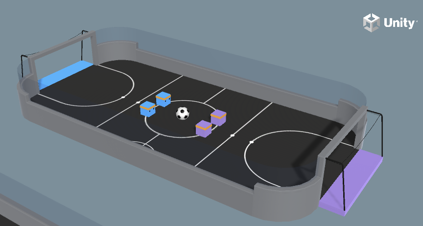

# 5-14 Soccer

# Soccerの概要

「Soccer」はエージェントがチームで対戦するサッカーゲームの学習環境です。「エージェント」は、前後進と左右移動の行動をとることができます。相手ゴールにボールが入った時は（1.0 - 現在のでステップ / maxStep）のグループ報酬、自分のゴールにボールが入った時は「-1.0」のグループ報酬となります。  
エージェントには「Generic」と「Striker」と「Goalie」という３つの役割（ポリシー）があり、それぞれ異なる報酬で学習させています。

```
・Generic:攻守の両方の役割を担うプレイヤー
・Striker:相手チームのゴールにボールを入れる役割を担うストライカー
・Goalie:自分チームのゴールにボールが入らないように阻止する役割を担うキーパー
```

「MA-POCA」を利用して、協調行動を学習する学習環境のサンプルになります。



<br>

## 提供されているシーン

「Soccer」のシーンは、「Assets/ML-Agents/Examples/Soccer/Scenes」で提供されています

```
・SoccerTwos:「Generic ✖︎ 2」対「Generic ✖︎ 2」で対戦する学習環境 
・StrikersVsGoalie:「Striker ✖︎ 2」対「Goalie ✖︎ 1」で対戦する学習環境
```

<br>

## ヒューリスティックモードのキー操作

```
W:前進,S:後進
A:左移動,D:右移動
E:左回転,Q:右回転
```

<br>

## 強化学習の要素

|項目|説明|
|---|---|
|観察|・RaycastObservation(スタック３)|
|行動|・Discrete(サイズ３)<br>0:前後進(0:なし、1:前進、2:後進)<br>1:左右移動(0:なし、1:左移動、2:右移動)<br>左右回転(0:なし、1:左回転、2:右回転)|
|報酬|・相手ゴールにボールが入った時は「1.0 - 現在のステップ / maxStep」のグループ報酬（エピソード完了）<br>・自分のゴールにボールが入った時は「-1.0」のグループ報酬（エピソード完了）<br>・毎ステップ「-0.5 / maxStep」<br>・さらにStrikerは、毎ステップ「-1 / maxStep」<br>・さらにGoalieは、「+1 / maxStep」|
|決定|・５ステップ毎|

<br>

## 学習設定ファイル

提供されている学習設定ファイルは、次の２つです
SoccerTwos用
```
・config/poca/SoccerTwos.yaml:POCA
```
<br>

StrikersVsGoalie
```
・config/poca/StrikersVsGoalie.yaml:POCA
```

<br>

## ソースコードの構成
ソースコードの構成は次のとおりです
```
・AgentSoccer.cs：エージェント実装
・SoccerBallController.cs：ボールの実装
・SoccerEnvController.cs：エリアの実装
・SoccerSettings.cs：設定項目
```

# 実装のポイント

ソースコードで重要な部分を解説します。

## MA-POCAによる協調行動の学習
「ML-Agents」には、協調行動を学習するためのトレーナーとして「MA-POCA」(MultiAgent POsthumous Credit Assignment)が追加されています。エージェントをグループ化して、そのグループに対してグループ報酬を与えることができます。また、エージェントのグループへの追加・削除は、任意のタイミングで行うことができます。  
「MA-POCA」の実装手順は、次のとおりです。

#### ①グループ毎にSimpleMultiAgentGroupのインスタンスを生成

今回は、

`SoccerEnvController.cs(一部)`
```cs
private SimpleMultiAgentGroup m_BlueAgentGroup;
private SimpleMultiAgentGroup m_PurpleAgentGroup;

```

<br>

`SoccerEnvController.cs(一部)`
```cs
void Start()
{
    (省略)
    m_BlueAgentGroup = new SimpleMultiAgentGroup();
    m_PurpleAgentGroup = new SimpleMultiAgentGroup();
    (省略)
}
```

<br>

SimpleMultiAgentGroupの主なメソッドは、次のとおりです。

```
・void RegisterAgent(Agent agent)：グループにエージェントを追加
・void AddGroupReward()：グループに報酬を加算
・void EndGroupEpisode()：グループのエピソード完了
・void GroupEpisodeInterrupted()：最大ステップ数到達時のエピソード完了
```

<br>


#### ②グループにエージェントを追加
RegisterAgent()でグループにエージェントを追加します。追加するエージェントは、同じ「BehaviorName」と「BehaviorParameters」を持つ必要があります。

`SoccerEnvController.cs(一部)`
```cs
void Start()
    {
        (省略)

        foreach (var item in AgentsList)
        {
            item.StartingPos = item.Agent.transform.position;
            item.StartingRot = item.Agent.transform.rotation;
            item.Rb = item.Agent.GetComponent<Rigidbody>();
            if (item.Agent.team == Team.Blue)
            {
                //青グループにエージェントを追加
                m_BlueAgentGroup.RegisterAgent(item.Agent);
            }
            else
            {
                //紫グループにエージェントを追加
                m_PurpleAgentGroup.RegisterAgent(item.Agent);
            }
        }
        ResetScene();
    }
```

<br>

#### ③報酬加算とエピソード完了を全エージェントまとめて行う
「MA-POCA」では、報酬加算とエピソード完了を全エージェントまとめて行う必要があります。今回は、ボールがゴールに入った時、まとめて行なっています。  

`SoccerEnvController.cs(一部)`
```cs
    //ボールがゴールに入った時に呼ばれる。
    public void GoalTouched(Team scoredTeam)
    {
        //報酬加算
        if (scoredTeam == Team.Blue)
        {
            m_BlueAgentGroup.AddGroupReward(1 - (float)m_ResetTimer / MaxEnvironmentSteps);
            m_PurpleAgentGroup.AddGroupReward(-1);
        }
        else
        {
            m_PurpleAgentGroup.AddGroupReward(1 - (float)m_ResetTimer / MaxEnvironmentSteps);
            m_BlueAgentGroup.AddGroupReward(-1);
        }
        m_PurpleAgentGroup.EndGroupEpisode();
        m_BlueAgentGroup.EndGroupEpisode();
        //シーンのリセット
        ResetScene();

    }
```
<br>

最大ステップ到達時のエピソード完了も、まとめて行なっています。    

`SoccerEnvController.cs(一部)`
```cs
    //定期的に呼ばれる
    void FixedUpdate()
    {
        //最大ステップ数到達時のエピソード完了
        m_ResetTimer += 1;
        if (m_ResetTimer >= MaxEnvironmentSteps && MaxEnvironmentSteps > 0)
        {
            m_BlueAgentGroup.GroupEpisodeInterrupted();
            m_PurpleAgentGroup.GroupEpisodeInterrupted();
            ResetScene();
        }
    }
```

<br>

#### ④学習設定ファイルのトレーナー種別にpocaを指定
「MA-POCA」で学習するには、学習設定ファイルの「trainer_type」に「poca」を指定する必要があります。「MA-POCA」は「PPO」と同じパラメータを使用するため、それ以外の「MA-POCA」固有のパラメータはありません。
```yaml
behaviors:
  SoccerTwos:
    #トレーナー種別
    trainer_type: poca
    ・
    ・
```


## MA-POCAを利用する際のポイント
「MA-POCA」を利用する際に、気を付けるべきポイントをいくつか紹介します。

```
・エージェントは、1度に１つのグループにのみ登録できる
・グループ内のエージェントは、同じBehaviorNameとBehaviorParametersを持つ必要がある
・グループ内のエージェントは、「MaxSteps」に「0」を指定する必要がある。最大ステップ数を処理するには、GroupEpisodeInterrupted()を使う
・個々のエージェントでエピソード完了したい場合は、EndEpisode()の代わりにエージェントの無効または破棄を行う。EndEpisode()を呼び出すとOnEpisodeBegin()が呼び出され、エージェントがすぐにリセットされてしまう
・無効にしたエージェントを再度有効にする場合は、グループに再登録する必要がある。
・グループ報酬と個々のエージェントの報酬は異なる。そのため、AddGroupReward()を１回呼ぶことと、AddReward()を全エージェントに対して呼ぶことは同じではない
・グループ内のエージェントは、AddReward()でそのエージェントのみに報酬を加算できる
```


# グループとチームID
「Unity ML-Agents」には、今回説明した「グループ」のほかに「チームID」という概念があります。  
一緒に作業するエージェントは、同じグループに追加する必要があります。互いに対戦するエージェントは、異なるチームIDを付与する必要があります。  
シーンに１つの競技場と２つのチームがある場合、各チームに１つずつ、合計２つのグループがあり、各チームに異なるチームIDを割り当てる必要があります。  
学習のスピードアップなどの目的で、競技場がシーン内で何個も複製される場合、競技場ごとに２つのグループが追加で必要になりますが、シーン全体で必要なチームIDは２つのままです。  
「グループ」と「チームID」の両方が設定されている環境では、「MA-POCA」と「セルフプレイ」の両方を同時に使用して学習することができます。


