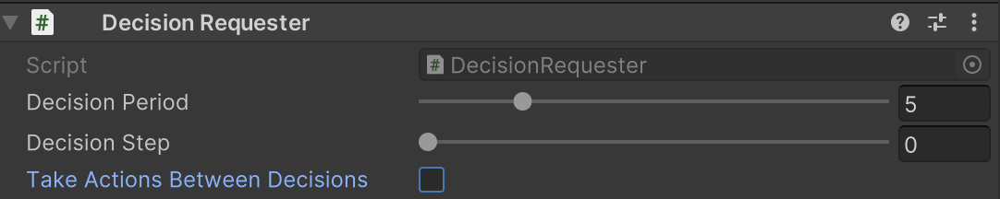

# 6-2 ジャンプゲーム　- テストの自動化

## ジャンプゲームの概要

「ジャンプゲーム」はユニティちゃんをタイミングよくジャンプさせて、ブロックを飛び移りつつできるだけ遠くへ行くことを競うゲームです。画面外から迫り来るブロックに横から衝突したり、落下したらゲームオーバーで、それまでの時間がスコアになります。


## 強化学習の要素

|項目|説明|
|---|---|
|観察|説明|
|||
|||
|||


<br>


## 学習設定ファイル
```
・JumpGame.yaml：ジャンプゲームの学習環境
```
<br>

## ソースコード
```
・JumpAgent.cs：エージェントの実装
・Main.cs：ゲームの実装
・TriggerListener.cs：衝突判定の実装
```

<br>


## インストール

・<a href="https://drive.google.com/drive/folders/1AJkScgeqh2AZD4iH7-2QbmGucvFAiv-J" target="_blank">サンプルファイル</a>

<br>


## ゲームへの強化学習の要素の追加
ゲームへの強化学習の要素の追加手順、次のとおりです。

#### ①

ゲーム用のキー入力をコメントアウト  
操作主体を「Unity ML-Agents」に置き換えるための準備になります。
`Main.cs`
```cs
this.nextKeyPress = Input.GetKey(KeyCode.Space);
```
↓
```cs
// this.nextKeyPress = Input.GetKey(KeyCode.Space);
```


<br>

#### ②ゲームオブジェクト「Main」に「Behavior Parameters」を追加

「」


#### ③

`JumpAgent.cs`
```cs
using System.Collections.Generic;
using UnityEngine;
using Unity.MLAgents;
using Unity.MLAgents.Sensors;
using Unity.MLAgents.Actuators;
using Unity.MLAgents.Policies;

// JumpAgent
public class JumpAgent : Agent
{
    public Main main;

    // エピソード開始時に呼ばれる
    public override void OnEpisodeBegin()
    {
        main.SetScene(Main.S_PLAY);
    }

    // 行動決定時に呼ばれる
    public override void OnActionReceived(ActionBuffers actionBuffers)
    {
        // キー操作
        main.nextKeyPress = (actionBuffers.DiscreteActions[0] == 1);

        // 生存報酬
        AddReward(1f / 5000f);

        // エピソード完了
        if (this.main.scene != Main.S_PLAY)
        {
            EndEpisode();
        }
    }

    // ヒューリスティックモードの行動決定時に呼ばれる
    public override void Heuristic(in ActionBuffers actionBuffers)
    {
        var actionsOut = actionBuffers.DiscreteActions;
        actionsOut[0] = Input.GetKey("space") ? 1 : 0;
    }
}
```

<br>

#### ④ゲームオブジェクト「Main」に「DecisionRequester」を追加

[「Take Actions Between Decisions」](6_2_1.md)のチェックを外す



<br>

#### ⑤


## 学習の実行


## テストの自動化


