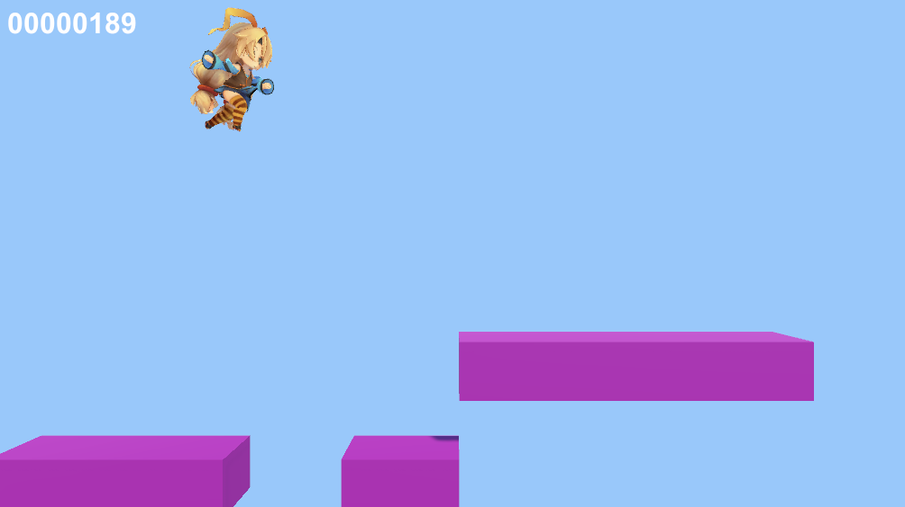

# ジャンプゲーム　- テストの自動化

## ジャンプゲームの概要

「ジャンプゲーム」はユニティちゃんをタイミングよくジャンプさせて、ブロックを飛び移りつつできるだけ遠くへ行くことを競うゲームです。画面外から迫り来るブロックに横から衝突したり、落下したらゲームオーバーで、それまでの時間がスコアになります。



## 強化学習の要素

|項目|説明|
|---|---|
|観察|[GridSensor(スタック３)](../5/5_10.md)|
|行動|・Discrete(サイズ1)<br>0:ジャンプボタン(0:解放、1:押下)|
|報酬|・ステップ毎: + 1/5000|
|決定|5ステップ毎|


<br>


## 学習設定ファイル
```
・JumpGame.yaml：ジャンプゲームの学習環境
```
<br>

## ソースコード
```
・JumpAgent.cs：エージェントの実装
・Main.cs：ゲームの実装
・TriggerListener.cs：衝突判定の実装
```

<br>


## サンプルインストール

・<a href="https://drive.google.com/drive/folders/1AJkScgeqh2AZD4iH7-2QbmGucvFAiv-J" target="_blank">サンプルファイル</a>

<br>


## ゲームへの強化学習の要素の追加
ゲームへの強化学習の要素の追加手順、次のとおりです。

#### ①キー入力のコメントアウト

ゲーム用のキー入力をコメントアウト  
操作主体を「Unity ML-Agents」に置き換えるための準備になります。
`Main.cs`
```cs
this.nextKeyPress = Input.GetKey(KeyCode.Space);
```
↓
```cs
// this.nextKeyPress = Input.GetKey(KeyCode.Space);
```


<br>

#### ②ゲームオブジェクト「Main」に「Behavior Parameters」を追加

「Behavior Name」に「JumpGame」、  
「VectorObservation → SpaceSize」に0、  
「Actions → DiscreteBranches」に1、
「Batch 0 Size」に２を指定します。


<br>

#### ③ゲームオブジェクト「Main」にスクリプト「JumpAgent.cs」を追加

`JumpAgent.cs`
```cs
using System.Collections.Generic;
using UnityEngine;
using Unity.MLAgents;
using Unity.MLAgents.Sensors;
using Unity.MLAgents.Actuators;
using Unity.MLAgents.Policies;

// JumpAgent
public class JumpAgent : Agent
{
    public Main main;

    // エピソード開始時に呼ばれる
    public override void OnEpisodeBegin()
    {
        main.SetScene(Main.S_PLAY);
    }

    // 行動決定時に呼ばれる
    public override void OnActionReceived(ActionBuffers actionBuffers)
    {
        // キー操作
        main.nextKeyPress = (actionBuffers.DiscreteActions[0] == 1);

        // 生存報酬
        AddReward(1f / 5000f);

        // エピソード完了
        if (this.main.scene != Main.S_PLAY)
        {
            EndEpisode();
        }
    }

    // ヒューリスティックモードの行動決定時に呼ばれる
    public override void Heuristic(in ActionBuffers actionBuffers)
    {
        var actionsOut = actionBuffers.DiscreteActions;
        actionsOut[0] = Input.GetKey("space") ? 1 : 0;
    }
}
```

<br>

#### ④ゲームオブジェクト「Main」に「DecisionRequester」を追加

[「Take Actions Between Decisions」](6_2_1.md)のチェックを外す


<br>

#### ⑤ゲームオブジェクト「Main」に「GridSensor」を追加


「CellScale」と「GridSize」を学習しやすいように調整後、「DetectableTags」で検出するオブジェクトを設定します。

検出するオブジェクトは、以下の２つです。「ShowGizmo」でグリッドを可視化することができます  
黄色：Player
青色：Block

<br>


## 学習の実行

#### ①学習設定ファイルの準備

```yaml
behaviors:
  JumpGame:
    trainer_type: ppo

    max_steps: 20000000
    time_horizon: 128
    summary_freq: 10000
    keep_checkpoints: 5

    hyperparameters:
      batch_size: 128
      buffer_size: 2048
      learning_rate: 0.0003
      learning_rate_schedule: linear

      beta: 0.01
      epsilon: 0.2
      lambd: 0.95
      num_epoch: 3

    network_settings:
      normalize: false
      hidden_units: 256
      num_layers: 2
      vis_encode_type: simple

    reward_signals:
      extrinsic:
        gamma: 0.99
        strength: 1.0

```

#### ④学習コマンドの実行

```
mlagents-learn ./config/sample/JumpGame.yaml --run-id=JumpGame-1
```
12Mステップで、0.009の報酬が得られます。(グラフ等で確認)

<br>

## テストの自動化

ゲーム開発では、ほんの少しの修正でもしっかり動作確認をしないと、致命的なバグに繋がってしまうことがよくあります。とはいえ、ほんの少しの修正のたびにテストチームを走らせるのはコストがかかります。  
そのような場合は、強化学習エージェントを使うことで、人手をかけずにテストを自動的に行なってもらうのが効果的です。  
テストには想定している操作を確認する「正常系テスト」と、想定していない操作を確認する「異常系テスト」があります。
```
・正常系テスト：学習済みエージェントにプレイさせて、最後までクリアできるかを確認
・異常系テスト：未学習のエージェントを学習させながらプレイさせて、多様性のある行動でプレイ状況を確認
```
<br>

たとえば、ジャンプ中の特定のタイミングのみ。再度ジャンプできてしまう不具合があったとしても、「異常系テスト」を行うことで発見することができます。  
以下のようにジャンプ時の地面判定を無くした状態で異常系テストを行うと、上空の死なない安全地帯で飛び続けてしまう行動を覚えてしまうことがわかります。

`Main.cs()`
```cs
    // ジャンプ
    if (this.bottomTrigger.IsHit() && !this.keyPress && this.nextKeyPress)
```
下のようにしてしまう
↓
```cs
    // ジャンプ
    if (/*this.bottomTrigger.IsHit() && */ !this.keyPress && this.nextKeyPress)
```