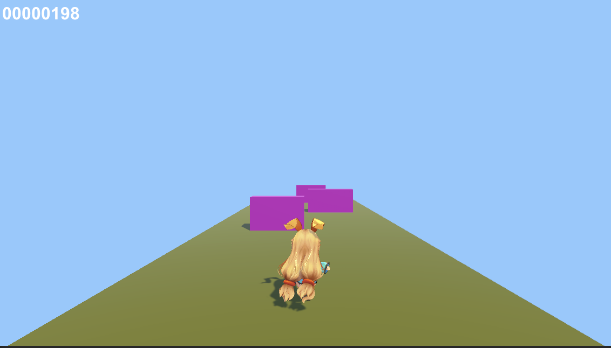
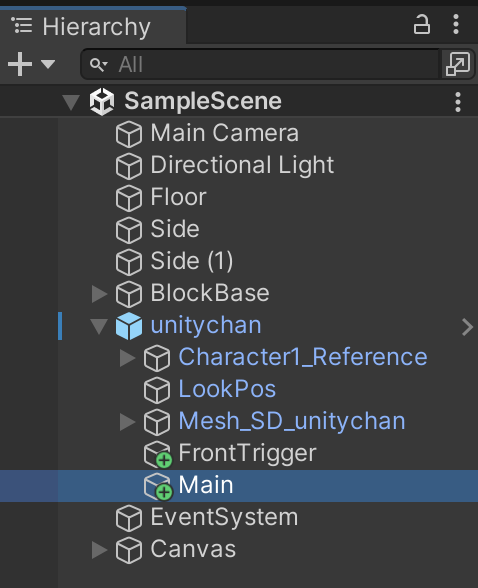
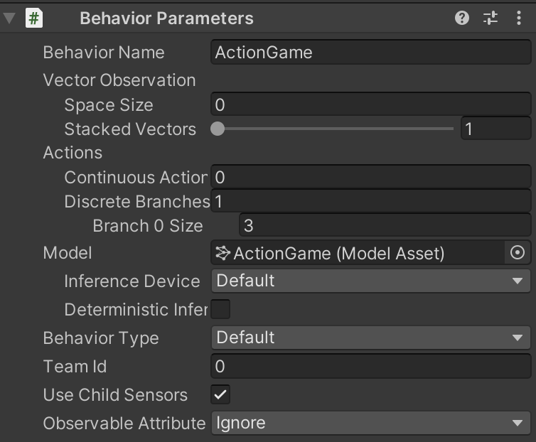
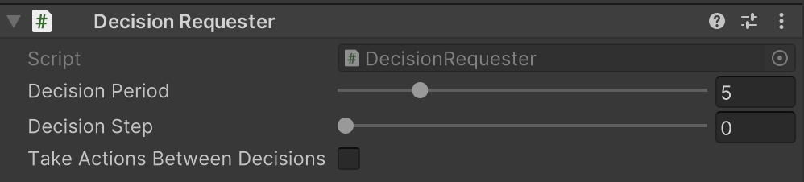
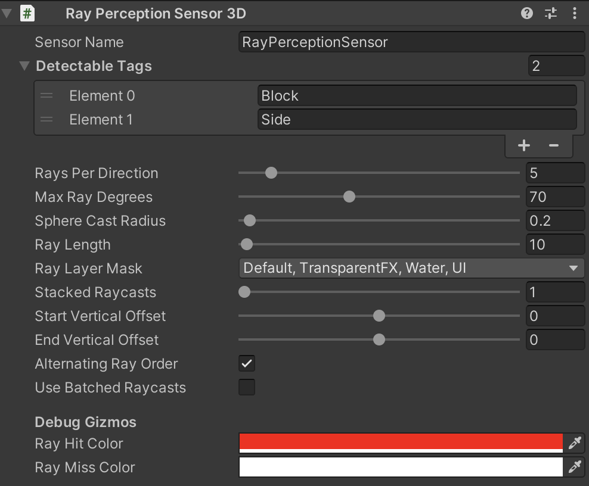
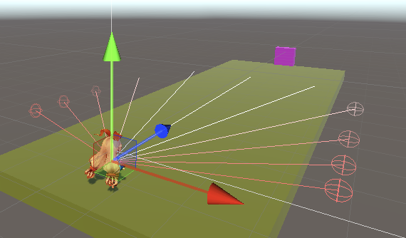

# 障害物避けゲーム　ー コンテンツのバランス調整のサポート

## 障害物避けゲームの概要

「障害物避けゲーム」はユニティちゃんを左右に移動させて、障害物となるブロックを避けてできるだけ遠くへ行くことを競うゲームです。画面外から迫り来るブロックに衝突したり、落下したらゲームオーバーで、それまでの時間がスコアになります。



<br>

## 強化学習の要素

|項目|説明|
|---|---|
|観察|・RaycastObservation|
|行動|・<br>0:移動(0:なし、1:左移動、2:右移動)|
|報酬|・ステップ毎：+ 1/5000|
|決定|5ステップ毎|

<br>

## 学習設定ファイル
```
ActionGame.yaml：障害物避けゲームの学習環境
```
<br>

## ソースコードの構成

```
・ActionAgent.cs：エージェントの実装
・Main.cs：ゲームの実装
・TriggerListener.cs：衝突判定の実装
```

<br>

## サンプルインストール

・<a href="https://drive.google.com/drive/folders/1AJkScgeqh2AZD4iH7-2QbmGucvFAiv-J" target="_blank">サンプルファイル</a>

<br>

## ゲームへの強化学習の要素の追加

#### ①キー入力のコメントアウト

ゲーム用のキー入力をコメントアウトします。操作主体を「Unity ML-Agents」に置き換えるための準備になります。

`Main.cs(変更)`
```cs
    void Update()
    {
        // 行動の更新
        this.action = A_NONE;
        if (this.scene == S_PLAY)
        {
            if (Input.GetKey(KeyCode.LeftArrow)) this.action = A_LEFT;
            if (Input.GetKey(KeyCode.RightArrow)) this.action = A_RIGHT;
        }
        else if (this.scene == S_GAMEOVER)
        {
            if (Input.GetKey(KeyCode.Space)) SetScene(S_PLAY);
        }
    }
```
↓
```cs
    /*
    void Update()
    {
        // 行動の更新
        this.action = A_NONE;
        if (this.scene == S_PLAY)
        {
            if (Input.GetKey(KeyCode.LeftArrow)) this.action = A_LEFT;
            if (Input.GetKey(KeyCode.RightArrow)) this.action = A_RIGHT;
        }
        else if (this.scene == S_GAMEOVER)
        {
            if (Input.GetKey(KeyCode.Space)) SetScene(S_PLAY);
        }
    }
    */
```

#### ② ゲームオブジェクト「Main」に「Behavior Parameters」を追加






#### ③ゲームオブジェクト「Main」にスクリプト「ActionAgent.cs」を追加

`ActionAgent.cs`
```cs
using System.Collections.Generic;
using UnityEngine;
using Unity.MLAgents;
using Unity.MLAgents.Sensors;
using Unity.MLAgents.Actuators;
using Unity.MLAgents.Policies;

// ActionAgent
public class ActionAgent : Agent
{
    public Main main;

    // エピソード開始時に呼ばれる
    public override void OnEpisodeBegin()
    {
        // 環境パラメータの設定
        EnvironmentParameters envParams = Academy.Instance.EnvironmentParameters;
        main.blockWidthMin = envParams.GetWithDefault("blockWidthMin", 0.5f); // ブロック最小幅
        main.blockWidthMax = envParams.GetWithDefault("blockWidthMax", 2.0f); // ブロック最大幅
        main.blockInterval = (int)envParams.GetWithDefault("blockInterval", 50); // ブロックスインターバル
        main.blockSpeed = envParams.GetWithDefault("blockSpeed", 0.08f); // ブロック速度 0.08f

        // プレイへの遷移
        main.SetScene(Main.S_PLAY);
    }

    // 行動決定時に呼ばれる
    public override void OnActionReceived(ActionBuffers actionBuffers)
    {
        // キー操作
        main.action = actionBuffers.DiscreteActions[0];

        // 生存報酬
        AddReward(1f / 5000f);

        // エピソード完了
        if (this.main.scene != Main.S_PLAY)
        {
            EndEpisode();
        }
    }

    // ヒューリスティックモードの行動決定時に呼ばれる
    public override void Heuristic(in ActionBuffers actionBuffers)
    {
        var actionsOut = actionBuffers.DiscreteActions;
        if (Input.GetKey(KeyCode.LeftArrow) || Input.GetKey(KeyCode.Space))
        {
            actionsOut[0] = 1;
        }
        else if (Input.GetKey(KeyCode.RightArrow))
        {
            actionsOut[0] = 2;
        }
        else
        {
            actionsOut[0] = 0;
        }
    }
}
```

<br>

#### ④ゲームオブジェクト「Main」に「Decision Requester」を追加
「Take Actions Between Decisions」のチェックを外します。



<br>

#### ⑤ゲームオブジェクト「Main」に「Ray Perception Sensor 3D」を追加
「Ray」を学習しやすいように調整後、「Detectable Tags」で検出するオブジェクトを設定します。  
検出するオブジェクトは、以下の２つです。サイドは、道の両端に見えないオブジェクトとして配置しています。「Gizmo」でレイの可視化ができるかと思います。





## 学習の実行

#### ①
```yaml
behaviors:
  ActionGame:
    trainer_type: ppo

    max_steps: 2000000
    time_horizon: 128
    summary_freq: 10000
    keep_checkpoints: 5

    hyperparameters:
      batch_size: 128
      buffer_size: 2048
      learning_rate: 0.0003
      learning_rate_schedule: linear

      beta: 0.005
      epsilon: 0.2
      lambd: 0.95
      num_epoch: 3

    network_settings:
      normalize: false
      hidden_units: 128
      num_layers: 2
      vis_encode_type: simple

    reward_signals:
      extrinsic:
        gamma: 0.99
        strength: 1.0


environment_parameters:
  blockWidthMin:
    sampler_type: uniform
    sampler_parameters:
      min_value: 0.5
      max_value: 2.0

  blockWidthMax:
    sampler_type: uniform
    sampler_parameters:
      min_value: 2.0
      max_value: 4.0

  blockInterval:
    sampler_type: uniform
    sampler_parameters:
      min_value: 30
      max_value: 70

  blockSpeed:
    sampler_type: uniform
    sampler_parameters:
      min_value: 0.08
      max_value: 0.32

```
「環境パラメータのランダム化」を使って、様々なパラメータを攻略するように学習しています。

・blockWidthMin：ブロック最小幅（0.5 ~ 2.0）  
・blockWidthMax：ブロック最小幅（2.0 ~ 4.0）  
・blockInterval：何ステップ毎にブロックが出現するか（30 ~ 70）   
・blockSpeed：ブロック速度（0.08 ~ 0.32）

<br>

#### ②学習コマンドを実行
```
mlagents-learn ./config/sample/ActionGame.yaml --run-id=ActionGame-1
```

1Mステップで、0.08の報酬が得られます

<br>

## コンテンツのバランス調整のサポート

プレイヤーキャラの操作を学習するエージェントが作成できたので、ステージ構成を変更して、エージェントにプレイさせ、ステージの難易度を評価してみます。   
例えば、以下のようなパラメータを設定してスコアを比較してみます。

|ステージ|環境パラメータ|スコア|
|---|---|---|
|ステージ１|blockWidthMin=0.5<br>blockWidthMax=2<br>blockInterval=50<br>blockSpeed=0.08|5000|
|ステージ２|blockWidthMin=0.5<br>blockWidthMax=2<br>blockInterval=30<br>blockSpeed=0.32|859|
|ステージ３|blockWidthMin=3<br>blockWidthMax=4<br>blockInterval=30<br>blockSpeed=0.16|496|

ここからステージ１は圧倒的に簡単で、スピードの速いステージ２より、大きな障害物が出現するステージ３の方が難しいことがわかりました。このようにして、ステージの難易度調整をAIを活用して行うことができます。

