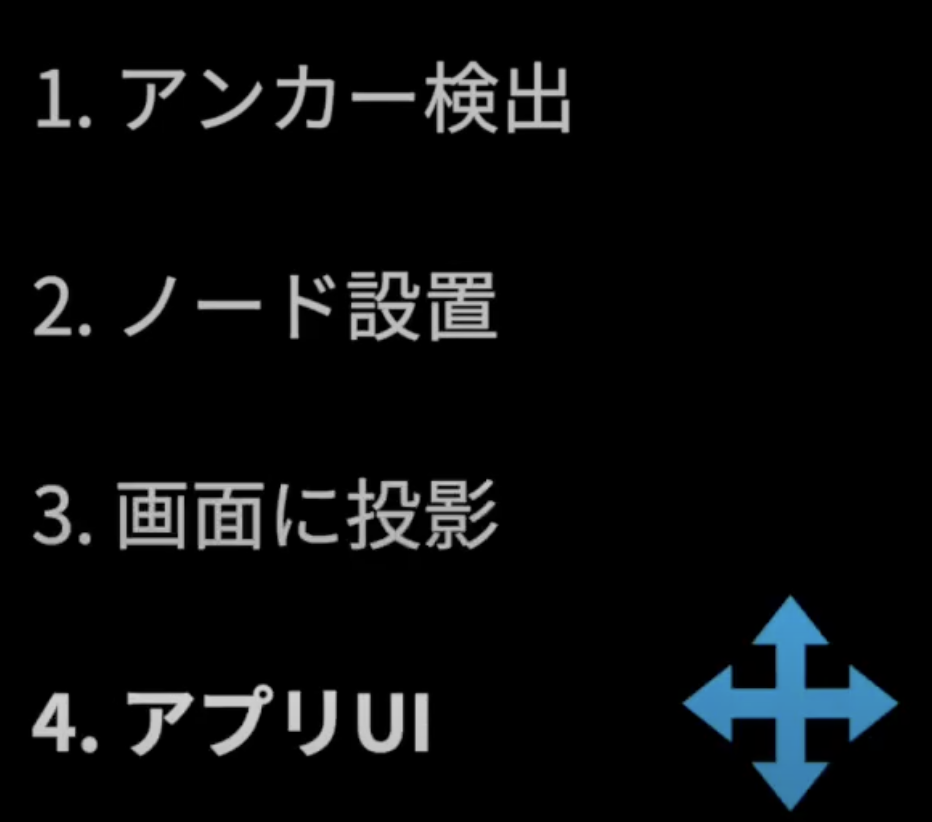
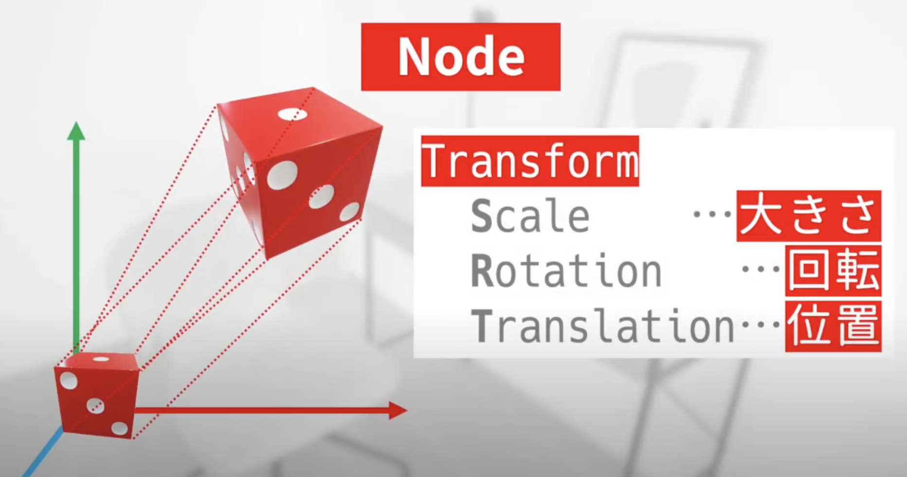

AR開発ステップ

 

### 0. **初期設定**
   - ARKit（iOS）やARCore（Android）のサポートを有効にし、AR Foundationパッケージをインポートします。
   - AR Session、AR Camera、AR Plane Manager、AR Raycast Managerなどのコンポーネントをシーンに配置します。

 

 

### 1. **アンカー検出 (Anchor Detection)**

- **目的**  
   ARオブジェクトを物理空間に「固定」するために、ARシステムがカメラやセンサーを利用して環境内の平面や物体を「検出」し、アンカー（固定ポイント）を設置します。これにより、仮想オブジェクトが現実空間の特定の位置に継続的に固定され、ユーザーがカメラの視点を変えてもその位置を維持できます。

- **プロセス**  
   - **環境スキャンと平面検出**  
      物理空間をスキャンして、机や床などの平面や壁などの物理的なオブジェクトを検出します。`ARRaycastManager` や `ARPlaneManager` を使用して、ユーザーがカメラをかざした際に、平面や物体の位置を検出します。

   - **使用するクラスと役割**  
     - `ARRaycastManager`:  
       ユーザーが画面上でタッチした位置にレイキャストを行い、そのタッチ位置に対応する現実空間の平面を検出します。これにより、検出した平面に「アンカー」を配置でき、仮想オブジェクトをその位置に固定することが可能です。例えば、ARアプリで家具を配置する場合、ユーザーが指定した場所に家具を固定できます。
       
     - `ARPlaneManager`:  
       環境内で検出された平面を描画し、ユーザーにその平面が検出されたことを視覚的に示します。このクラスによって生成される平面データを利用して、アンカーやオブジェクトの配置を行います。
       
     - **アンカー設置 (`ARAnchor`)**  
       検出された平面やオブジェクトの位置に対して `ARAnchor` を作成します。これにより、仮想オブジェクトがその位置に固定され、安定した表示が可能になります。

 

 

 

 

 

> [アンカー検出_実装例](5_1_検出1_サンプルコード1)
>
> [その他の検出例](5_1_検出2_Detection.md)

 

   アンカー検出を行うことで、物理空間内の特定の位置に仮想オブジェクトを「永続的」に固定でき、視点が変わってもオブジェクトがその位置を維持します。この仕組みは、ARで現実空間に仮想オブジェクトを自然に配置するための基礎となります。

 

 

### 2. **ノード設置 (Node Placement)**

この説明は概ね正確ですが、以下の点を少し補足して解説すると、さらに明確になると思います。

### 補足と説明

1. **ノード設置**について  
   - **ノード設置**とは、仮想オブジェクト（「ノード」とも呼ばれるポイントやターゲット）を、特定の位置に配置することを指します。これには、ユーザーの現実空間の位置情報や平面検出データを活用して、仮想オブジェクトを物理的に見える空間に固定するプロセスが含まれます。

2. **Unityシーン内での設置と現実空間への配置**  
   - Unityエディタ上でシーンに直接配置するだけでなく、実際にはARアプリケーションを通じてユーザーが見ている現実空間に設置する目的で配置します。このようにして、物理空間に合った場所に仮想オブジェクトを設置できるようになります。

3. **アンカーと検出位置への配置**  
   - ユーザーが画面をタッチしたとき、**AR Raycast**で検出された平面や位置に基づいて、仮想オブジェクトを配置します。このとき、**アンカー**として設定される位置は、ユーザーが選択した現実の場所に固定され、仮想オブジェクトがそこに留まるようにします。  

4. **`Instantiate`関数の使用**  
   - Unityでは、`Instantiate`を使用してプレハブ（仮想オブジェクトのテンプレート）を生成し、**AR Raycast**で得られた位置に配置します。これにより、オブジェクトは物理空間に固定されているかのように見え、AR体験が現実に即したものになります。

5. **視覚と物理空間の一部としての表現**  
   - 配置されたオブジェクトは、現実世界に実在するかのように見え、物理空間の一部として自然に感じられるように動きます。このため、ユーザーがデバイスを通して現実空間を見る際に、ARオブジェクトがその空間内に存在するように見えるのが特徴です。

---

### 修正後の説明

> ノード設置は、ARシーン内で特定の位置にオブジェクト（ターゲットやポイントと呼ばれるノード）を配置することを指します。
これにより、仮想オブジェクトがユーザーの現実空間に固定されているように見える効果を得ることができます。
例えば、ユーザーが画面をタッチして物理空間内の平面を検出し、仮想オブジェクト（家具やアイテム）をアンカーとしてその位置に配置します。
Unityの`Instantiate`を用いてプレハブを生成し、検出された位置に配置することで、仮想オブジェクトは現実の一部として視覚的に存在し、ユーザーに物理的な空間にいるような錯覚を与えます。

 

 

 

 

 

### 3. **画面に投影 (Screen Projection)**
   - 実際にユーザーのデバイス画面上に仮想オブジェクトを表示します。
   - 投影は、物理空間に仮想オブジェクトがどのように見えるかを画面上にリアルタイムで表示することです。

   **実装例**:
   - 画面上のタッチ位置に合わせてオブジェクトを配置します。画面にオブジェクトが「投影」される形となります。

   - ユーザーがタッチした位置に、ARオブジェクトを投影し、物理空間内に配置します。これにより、ユーザーがAR空間内で実際にオブジェクトを見て操作できるようになります。

   こちらは、カメラ越しに現実空間を写した画面上に、バーチャルなオブジェクトが重ねられて表示されることを指します。たとえば、ARアプリを通じてスマートフォン画面を見たときに、現実のテーブルの上にキャラクターや家具が「投影」されているように見えるのがこの「投影」にあたります。

 

 

 

 

 

 

### 4. **アプリUI (App UI)**
   - ユーザーがARコンテンツとやり取りするためのインターフェースを作成します。
   - ARコンテンツ自体だけでなく、メニューや操作ボタン、設定などのユーザーインターフェースを追加します。

   **実装例**:
   - メニューを表示したり、UIボタンをタッチしてARのオブジェクトにアクションを起こす機能を追加します。ARオブジェクトに関する設定をユーザーが操作できるようにします。

   - ARのインタラクションに加えて、メニューや設定ボタンを追加します。これにより、ユーザーはARコンテンツとインタラクションしながら操作することができます。

 

 

 

 

 

 

 

### 5. **追跡 (Tracking)**
   - ユーザーの動きに合わせて、ARオブジェクトが追跡され、位置や回転が変化するようにします。
   - ユーザーがARオブジェクトを動かしたり、カメラを動かした場合でも、そのオブジェクトが物理空間内で適切に追跡され、配置されるようにします。

   **実装例**:
   - オブジェクトを追跡するために、ARオブジェクトの位置情報をリアルタイムで更新します。`ARTrackedObject`や`ARSession`を使って、デバイスの動きに合わせてオブジェクトが移動するようにします。

   - ユーザーのカメラの動きやオブジェクトの動きに基づき、ARオブジェクトが物理空間内で追跡されます。位置や回転を動的に更新し、現実世界の動きに合わせて調整します。

### 6. **最終調整とビルド (Final Adjustments and Build)**
   - 実装が完了したら、ARアプリケーションをテストして調整を行います。最終的なビルドを行い、ターゲットプラットフォームに向けて出力します。
   - デバイスに合わせて最適化やパフォーマンスチューニングを行います。

   **実装例**:
   - 最後に、アプリケーションが実際のAR環境で正しく動作するかを確認し、バグを修正します。その後、iOSやAndroid向けにビルドし、デバイスにインストールしてテストします。

   - 実際のデバイスでテストし、パフォーマンスや動作を確認します。その後、ARアプリをターゲットプラットフォーム（iOS、Android、Web等）向けにビルドします。

