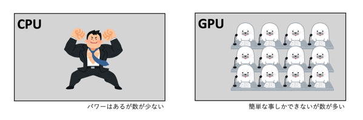

<br>


<br>


# GPUで簡単な計算を行ってみる

バッファー
プログラムがデータを一時的に格納するための領域


uint3 は、3つの符号なし整数（unsigned integer）からなるベクトルを表すデータ型です。具体的には、通常は3次元空間内の位置や方向などを表すために使用されます。

特徴と用途
データ型: uint3 は、3つの uint 型の整数値を持つベクトルです。各成分は非負の整数であり、通常は0以上の値を取ります。

使用例:

グラフィックスプログラミング: 3次元空間の座標を表現するために使用されます。例えば、頂点の位置や法線ベクトルなどを格納するために uint3 型が利用されることがあります。
計算処理: 特定のアルゴリズムやデータ構造で、3つの整数値をまとめて扱う必要がある場合にも使用されます。


```c
#pragma kernel HeavyProcess

RWStructuredBuffer<int> intBuffer;
int intValue;

[numthreads(64,1,1)]
void HeavyProcess(uint3 groupID : SV_GroupID, uint3 groupThreadID : SV_GroupThreadID)
{
    intBuffer[groupThreadID.x] = 0;
    for (int i = 0; i < 100; i++)
    {
        intBuffer[groupThreadID.x] += intValue;
    }
}
```

+ カーネル

GPUで実行される１つの処理
コード上では１つの関数


+ スレッド

カーネルを実行する単位
1スレッド　= 1カーネルを実行
computeshader では　カーネルを複数のスレッドで並列して同時に実行

スレッドは(x,y,z)の形で指定


+ グループ

スレッドを実行する単位
あるグループが実行するスレッドはグループスレッド

グループも(x,y,z)の形で指定


(2,1,1)グループが(4,4,1)スレッドでカーネルを実行というと
2*1*1の2グループで、それぞれ4*4*1の16スレッドを持ち、合計2*16の32スレッドあることになる


「#pragma kernel」でカーネルを指定して、「numthreads」でスレッド数を指定します。

スレッドは(X,Y,Z)の形式で指定して参照することで使用します。

今回の場合はXに64を指定しているので、各スレッドで「groupThreadID.x」に0〜63の数値が入ってくる形になります。


引数の「SV_GroupThreadID」にはスレッドのIDが渡されてきます。
「SV_GroupID」は、グループのIDが渡されますが、こちらの数は後述のC#側で指定します。


```cs

using UnityEngine;

public class HeavyProcess : MonoBehaviour
{
    [SerializeField] private ComputeShader computeShader;
    private int _kernelHeavyProcess;
    private ComputeBuffer _intComputeBuffer;

    private void Start()
    {
        // computeShaderからカーネル(処理する関数)取得 
        _kernelHeavyProcess = computeShader.FindKernel("HeavyProcess");

        // Buffer領域を確保　処理を行う場所確保
        _intComputeBuffer = new ComputeBuffer(64, sizeof(int));

        // computeShaderにパラメータを設定　
        computeShader.SetInt("intValue", 1);
        computeShader.SetBuffer(_kernelHeavyProcess, "intBuffer", _intComputeBuffer);

        //Compute Shaderにデータを渡すために使用　GPUで実行される計算シェーダーが、渡したデータバッファ内のデータにアクセスできるようになります。

        //　処理関数　変数名　　一時データ保存場所　
    }

    private void Update()
    {
        // GroupIDを指定して数回実行
        // (64,1,1)スレッド * (1,1,1)グループ
        // Dispatch で　処理を実行　(　実行処理とグループ数　)
        computeShader.Dispatch(_kernelHeavyProcess, 1, 1, 1);

        // 実行結果
        var result = new int[64];
        _intComputeBuffer.GetData(result);//GPUバッファからデータを取得 resultに保存 
        Debug.Log("RESULT: HeavyProcess");
        for (var i = 0; i < 64; i++)
        {
            Debug.Log(i + ":　" + result[i]);
        }
    }

    private void OnDestroy()
    {
        // バッファの解放
        _intComputeBuffer.Release();
    }
}


```


ComputeShaderをアタッチしておき、各処理を呼び出します。
ざっくりと
・「ComputeShader.FindKernel」でカーネルを取得
・「ComputeShader.SetXXX」でパラメータを設定
・「ComputeShader.Dispatch」で処理を実行
といった流れになります。

<br>

# 演算結果をテクスチャに描画する

DrawTexture.compute
```c
#pragma kernel DrawTexture

RWTexture2D<float4> textureBuffer;//RWTexture2Dでテクスチャバッファを宣言して、float4型で描画色を設定


// SV_DispatchThreadID: 
// あるカーネルを実行するスレッドが全てのスレッドのどこに位置するか(X,Y,Z)
//計算式でいうと
// SV_Group_ID * numthreads + GroupThreadID
//座標位置が渡されるイメージ
//テクスチャは2Dのため今回はnumthreadsは(8,8,1)で、XYそれぞれ8スレッドずつで指定しています。
[numthreads(8,8,1)]
void DrawTexture(uint3 dispatchThreadID : SV_DispatchThreadID)
{
    // X方向になるほど濃くなるようにする
    float width, height;
    textureBuffer.GetDimensions(width, height);
    textureBuffer[dispatchThreadID.xy] = float4(
        dispatchThreadID.x / width,
        dispatchThreadID.x / width,
        dispatchThreadID.x / width,
        1);
}


```


```cs

using UnityEngine;

public class DrawTexture : MonoBehaviour
{
    [SerializeField] private ComputeShader computeShader;
    [SerializeField] private Renderer planeRenderer;

    private int _kernelDrawTexture;
    private RenderTexture _renderTexture;

    private struct ThreadSize
    {
        public readonly int X;
        public readonly int Y;
        public readonly int Z;
        public ThreadSize(uint x, uint y, uint z)
        {
            X = (int) x;
            Y = (int) y;
            Z = (int) z;
        }
    }
    private ThreadSize _kernelThreadSize;

    private void Start()
    {
        // RenderTextureの生成 
        //RenderTexture は、Unityで使用される特別な種類のテクスチャで、カメラの出力やその他のレンダリング結果をキャプチャするために使用されます
        _renderTexture = new RenderTexture(512, 512, 0, RenderTextureFormat.ARGB32);
        _renderTexture.enableRandomWrite = true;
        _renderTexture.Create(); //GPU上でレンダーテクスチャを初期化します。これにより、レンダーテクスチャが使用可能な状態になります。
        // RenderTexture を作成し、Compute Shaderで書き込みが可能なように enableRandomWrite プロパティを true に設定します。次に、Create メソッドを呼び出してGPU上にレンダーテクスチャを初期化します。


        // カーネル取得 動かす関数指定
        _kernelDrawTexture = computeShader.FindKernel("DrawTexture");

        // スレッドサイズの取得
        //カーネルのスレッドグループサイズを取得します。これにより、Dispatch メソッドを呼び出す際に必要なスレッドグループ数を計算できます。
        computeShader.GetKernelThreadGroupSizes(_kernelDrawTexture,
            out var threadSizeX,
            out var threadSizeY,
            out var threadSizeZ);
        _kernelThreadSize = new ThreadSize(threadSizeX, threadSizeY, threadSizeZ);

        // テクスチャの設定 動かす関数指定し、　     "textureBuffer" に RenderTexture を設定
        //Compute Shaderは指定されたRender Textureに対して読み書きができるようになります。
        computeShader.SetTexture(_kernelDrawTexture, "textureBuffer", _renderTexture);

        // カーネルの実行
        // 水平方向のグループ数: 512 / 8 = 64
        // それぞれのスレッドで設定する範囲を分担する
        //動かす処理　指定されたスレッドグループの数でシェーダーを実行します。スレッドグループの数は、レンダーテクスチャの幅と高さに基づいて計算されます。
        computeShader.Dispatch(
            _kernelDrawTexture,
            _renderTexture.width / _kernelThreadSize.X,
            _renderTexture.height / _kernelThreadSize.Y,
            _kernelThreadSize.Z);
        //カーネル実行の際に指定するグループ数は「幅/スレッド数」になります。
        //そうすることでスレッド実行ごとに描画する範囲を分担して処理することができます。


        // マテリアルに　テクスチャを設定
        planeRenderer.material.mainTexture = _renderTexture;
    }
}


```


