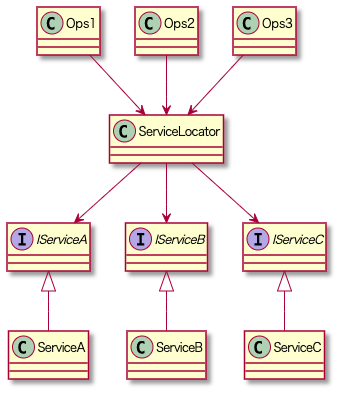

# サービスロケータについて

サービスロケーターパターン（Service Locator Pattern）は、クラスが必要とするサービス（インターフェースの実装）を取得するためのデザインパターンです。  
サービスロケータは、アプリケーション全体で使用される依存関係を集中管理し、クライアントコードが具体的なサービスのインスタンスを直接生成することを防ぎます。

<br>

# サービスロケーターパターンの構造

+ サービスインターフェース（Service Interface）: クライアントが使用するサービスのインターフェース。
+ 具体的なサービスクラス（Concrete Service Class）: サービスインターフェースを実装する具体的なクラス。
+ サービスロケーター（Service Locator）: サービスのインスタンスを取得するための中心的なクラス。

<br>

# サービスロケータの概要

例えば、いろんなクラスから呼び出されるクラスがあったとして、
これを直接呼び出した場合には下記のように複雑な依存関係になってしまいます。(Opsを直接呼び出している例)


<br>
そこで、ServiceLocatorクラスに各サービスクラスを登録。間を挟むことで、依存関係をまとめる


<br>


<br>
各サービスクラスのインタフェースを登録して、呼び出し元からはインタフェースを指定するようにすれば、サービスクラスの差し替えも簡単に行えるようになります



<br>

差し替えることができると、
使うサービスを変更したくなった時に応用が効くのはもちろん、
Dummyクラスに差し替えることでテストができるようになったり、
開発時にだけログ出力するクラスに差し替える
といったことができるようになります。


<br>

## ServiceLocator以外について

他に依存性を管理する手法としてDIコンテナが有名です。
ServiceLocatorとDIコンテナ、どちらを使用するべきか？についてはネット上の記事等を参考にしてみてください。

<a href="https://www.nuits.jp/entry/servicelocator-vs-dependencyinjection" target="_blank">Service Locator と Dependency Injectionパターン と DI Container</a>


本来不要なServiceLocatorクラスへの依存が発生してしまうこと、呼び出し側のコードが少し複雑になることなどから、DIコンテナの使用が推奨されることがあります。    
ただ、UnityでDIコンテナを利用するには、ZenjectやVContainerといったDIライブラリを使用することが多く、学習コストと導入コストもそれなりに高いです。    
そのため、個人レベルや規模が小さい場合にはServiceLocatorを使用し、慣れてきたら上記のようなDIライブラリを使うことに挑戦するというのも一つの手かと思います。


<br>

## 利点
+ 依存関係の管理: 依存関係を集中管理できるため、依存関係の注入や取得が容易になります。
+ 柔軟性: サービスの実装を簡単に変更できるため、テストや実行時に異なる実装を使用することができます。
+ 再利用性: サービスロケーターを使用することで、サービスの再利用性が向上します。

<br>

## 欠点
+ グローバルな状態: サービスロケーターはグローバルな状態を持つため、システム全体が密結合になるリスクがあります。
+ 依存関係の隠蔽: サービスロケーターを使用すると、クラスの依存関係がコード上に明示されなくなるため、コードの理解が難しくなる可能性があります。

<br>


##  サービスロケーターパターンの使用例1

<br>
型をkeyとしてDictionaryに登録することで、
呼び出し側からは型を指定して呼び出すことができるようになる。

```cs
using System;
using System.Collections.Generic;

namespace Services
{
    /// <summary> サービスロケータ </summary>
    public static class ServiceLocator
    {
        /// <summary> コンテナ </summary>
        private static readonly Dictionary<Type, object> Container;

        /// <summary> コンストラクタ </summary>
        static ServiceLocator()
        {
            Container = new Dictionary<Type, object>();
        }

        /// <summary> サービス取得 </summary>
        public static T Resolve<T>()
        {
            return (T) Container[typeof(T)];
        }

        /// <summary> サービス登録 </summary>
        public static void Register<T>(T instance)
        {
            Container[typeof(T)] = instance;
        }

        /// <summary> サービス登録解除 </summary>
        public static void UnRegister<T>()
        {
            Container.Remove(typeof(T));
        }
    }
}

```

<br>
例として、 `PlayerPrefsService`クラスを登録してみる

```cs
namespace Services
{
    public interface IPlayerPrefsService
    {
        public void SetInt(string key, int value);
        public int GetInt(string key);
    }
}
```

```cs
using UnityEngine;

namespace Services
{
    public class PlayerPrefsService : IPlayerPrefsService
    {
        public void SetInt(string key, int value)
        {
            PlayerPrefs.SetInt(key, value);
        }

        public int GetInt(string key)
        {
            return PlayerPrefs.GetInt(key);
        }
    }
}
```


<br>
プロジェクト初期化時、ServiceLocatorに登録

```cs
using Services;
using UnityEngine;

/// <summary>プロジェクト初期化クラス </summary>
public static class ProjectInitializer
{
    /// <summary> 初期化処理(シーンのロード前に呼ばれる)</summary>
    [RuntimeInitializeOnLoadMethod(RuntimeInitializeLoadType.BeforeSceneLoad)]
    private static void Initialize()
    {
        // サービス登録
        ServiceLocator.Register<IPlayerPrefsService>(new PlayerPrefsService());
    }
}

```


<br>
サービスクラスの呼び出し例(あとは各クラスでServiceLocator.Resolveを呼び出すことで、
各サービスを使用することができます)

```cs

using Services;
using UnityEngine;
using Utils;

namespace Scenes.Common
{
    /// <summary> PlayerPrefs管理クラス </summary>
    public static class SamplePlayerPrefs
    {
        /// <summary> スコア </summary>
        public static int Score
        {
            get => GetPlayerPrefsIntValue(KeyScore);
            set => SetPlayerPrefsIntValue(KeyScore, value);
        }
        private const string KeyScore = "Score";
        
        private static void SetPlayerPrefsIntValue(string key, int value)
        {
            ServiceLocator.Resolve<IPlayerPrefsService>().SetInt(key, value);
        }

        private static int GetPlayerPrefsIntValue(string key)
        {
            return ServiceLocator.Resolve<IPlayerPrefsService>().GetInt(key);
        }
    }
}

```

↓だけ適当なGameObjectにアタッチしてみて（他はフォルダにあれさえすればいい）
```cs

using Scenes.Common;
using UnityEngine;

public class ExampleUsage : MonoBehaviour
{
    void Start()
    {
        // スコアの設定
        SamplePlayerPrefs.Score = 42;

        // スコアの取得
        int score = SamplePlayerPrefs.Score;
        Debug.Log($"Current Score: {score}");
    }
}

```


<br>


<hr>

<br>

##  サービスロケーターパターンの使用例2
サービスロケーターパターンのシンプルな例。

<br>
サービスインターフェース。
指定された soundName を再生するためのメソッドです。

```cs
public interface IAudioService {
    void PlaySound(string soundName);
}
```

<br>
具体的なサービスクラス

```cs
using UnityEngine;

public class AudioService : IAudioService {
    public void PlaySound(string soundName) {
        Debug.Log("Playing sound: " + soundName);
        // 実際のサウンド再生ロジックを書く

    }
}
```
<br>
サービスロケーター。静的クラスとして定義され、サービスの登録と取得を行います。 

```cs
using System;
using System.Collections.Generic;

public static class ServiceLocator {
    private static Dictionary<Type, object> services = new Dictionary<Type, object>();

    public static void RegisterService<T>(T service) {
        var type = typeof(T);
        if (!services.ContainsKey(type)) {
            services[type] = service;
        }
    }

    public static T GetService<T>() {
        var type = typeof(T);
        if (services.ContainsKey(type)) {
            return (T)services[type];
        }
        throw new Exception("Service not found: " + type);
    }
}
```
services は Type をキーとし、サービスのインスタンスを値とする辞書。    
`RegisterService<T>` メソッドは、サービスインスタンスがすでに登録されていない場合のみ登録します。
`GetService<T>` メソッドは、登録されたサービスインスタンスを取得します。サービスが見つからない場合は例外をスローします。   

<br>
サービスロケーターの使用例（MonoBehaviour を継承し、Unity のゲームオブジェクトとして機能します。)  
下のスクリプトだけ適当なGameObjectにアタッチしてください。

```cs
using UnityEngine;

public class GameManager : MonoBehaviour {
    void Start() {
        // サービスの登録
        ServiceLocator.RegisterService<IAudioService>(new AudioService());

        // サービスの取得と使用
        var audioService = ServiceLocator.GetService<IAudioService>();
        audioService.PlaySound("BackgroundMusic");
    }
}
```

Start メソッド内で、AudioService のインスタンスを ServiceLocator に登録します。
登録後、ServiceLocator.GetService<IAudioService>() を使用して IAudioService のインスタンスを取得し、PlaySound メソッドを呼び出してサウンドを再生します


<br>
