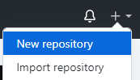
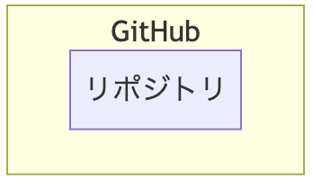
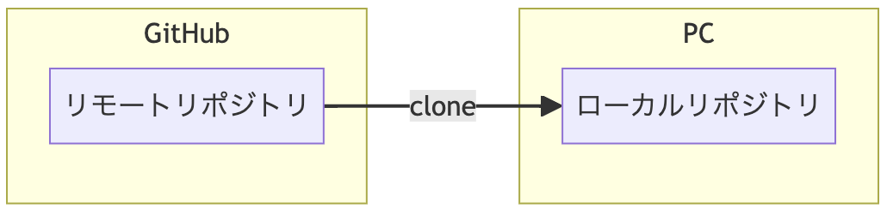
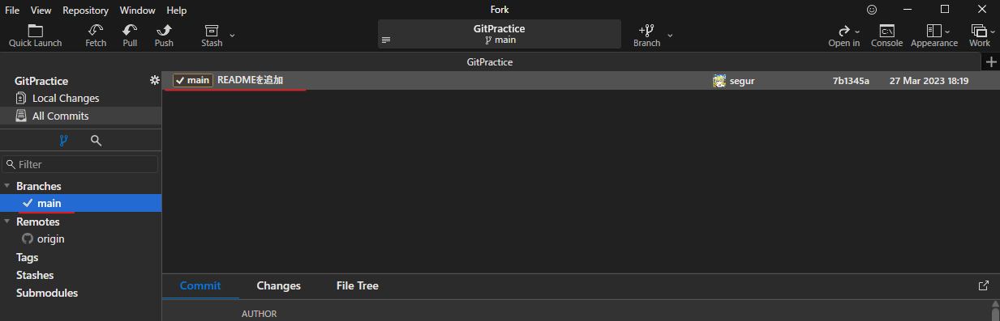
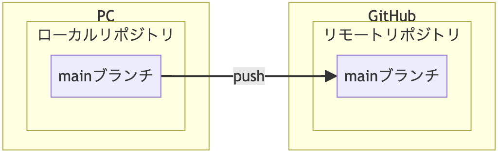

# GitHubアカウントを作成する
GitHubアカウントを持っていない方は、GitHubでアカウント作成。

詳しい手順は以下をご覧ください。

[https://reffect.co.jp/html/create_github_account_first_time](https://reffect.co.jp/html/create_github_account_first_time)

プランはFreeプランで大丈夫です。


# ForkをPCにインストールする
[https://git-fork.com/](https://git-fork.com/) からPCにForkをインストールしてください。

これはGitをGUIで操作するためのPCアプリケーションです。

インストールが終了したらアカウント連携まで行って下さい  
[アカウント連携例](https://sunny10side.com/how-to-install-and-use-fork-git-gui-client/)


# GitHubでリポジトリを作成する

GitHubで 右上の + > New repository をクリックします。



<br>

リポジトリとは、ファイルの編集履歴を管理する場のことです。
repositoryは貯蔵庫という意味の英単語です。  
GitHubサイトにフォルダを作成すると思ってくれて大丈夫です。



<br>

# リポジトリ名を記入する
リポジトリ名を記入してください。


<br>


# 公開範囲を選択する


<br>


# 作成ボタンをクリックする
Create Repositoryボタンをクリックして、以下のような画面を出して下さい。ここでのUrlを後ほど利用します。


<br>


# Forkでクローンする
サーバーのリポジトリ(フォルダ)をコピーして、PCにリポジトリを作ることをクローンと呼びます。


<br>

サーバー側のリポジトリを「リモートリポジトリ」  
PC側のリポジトリを「ローカルリポジトリ」  
と呼びます。

<br>

左上の File > Clone をクリックします。


<br>

さきほど作成したリポジトリURLを Repository Url 欄に入力。


<br>


+ Parent Folder  
PC側の作業ディレクトリ。
好きなフォルダーを指定してください。
ただし、日本語や半角スペースがパスに含まれていないフォルダーが安全です。

+ Name  
デフォルトのままでOK。（リポジトリ名と同じ）

+ Clone  
ボタンを押します。


# コミットする

コミットというのは、編集履歴に記録するデータの単位。  
編集履歴に記録する操作もコミットと呼ぶ。

## README.mdを作る
Fork右上の Open in > Open In File Explorer をクリックし、作業フォルダーが開く。


<br>

README.md というファイルを作成。
（.mdというのは、Markdownファイル）


<br>

README.md をテキストエディターで開き、以下のように入力して保存。

```
# GitHubハンズオン
```
文字コードはUTF-8で保存。でないとForkで文字化けします。

# README.mdをStageに追加


<br>

Forkの Local Changes をクリックすると、 Unstaged に README.md が追加される。

README.md をクリックすると、変更箇所が右側に表示される。  
（もし、文字化けしていたら、 README.md をUTF-8で保存。）

Stage ボタンをクリックすると、 Unstaged から Staged へREADME.mdが移動する。

# README.mdをコミットする

右下の Commit Message 欄に READMEを追加 と入力し、 Commit File ボタンをクリック。


<br>

左側の Branches > main をクリックすると、 READMEを追加 という行が追加されています。



<br>

# README.mdを編集する
テキストエディターで README.md を開き、適当に内容を書き換えて保存します。
```
# GitHubハンズオン
これはGitHubハンズオンのファイルです。
```
Forkで Local Changes を確認すると、再び Unstaged に README.md が表示されます。


<br>

右側には、前回と今回の差分が表示されています。

もし、差分が2列表示になっていない場合は、右上にある


<br>
をクリックしてください。  

<br>

# README.mdを再びコミット
Stage ボタンを押し、コミットメッセージに 「READMEを更新」 と入力し、コミットボタンを押す。

今度は左側のAll Commitsをクリックしてみます。

READMEを更新という行が新たに追加されていることを確認します！

このようにコミットという単位で編集履歴を管理します！


<br>

# ステージ
ステージは、コミットの候補となるファイル変更データを保管する場所。


(ブランチについては次回)

<br>

# プッシュ

プッシュとは、ローカルリポジトリの内容を、リモートリポジトリにコピーすること。



<br>

Forkの左上のPushボタンを押す。


<br>

以下のようなダイアログが出ます


<br>

Pushボタンを押すと、プッシュが始まります。
プッシュが完了したら、GitHubのリポジトリのページをリロードしてください。
README.md の内容が表示されたら、成功です。


