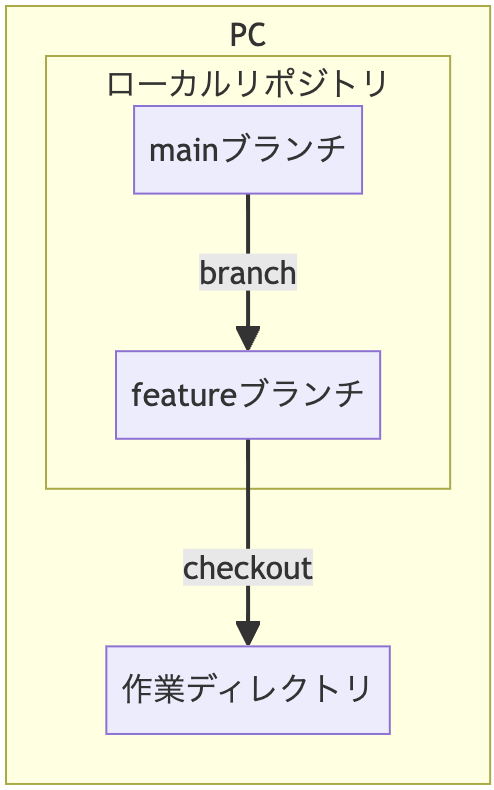
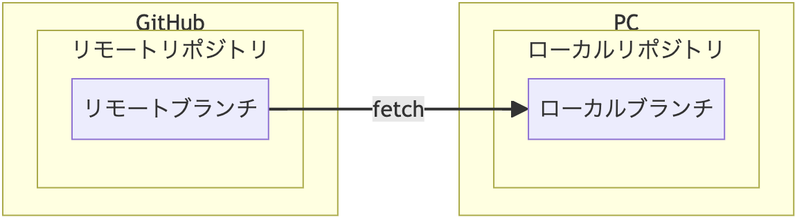
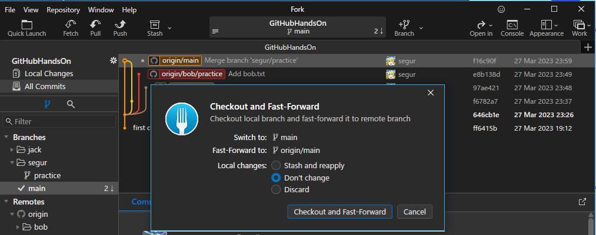

複数人で同時に作業することを想定した書き方をしています。  
１人で取り組む場合は、複数のローカルリポジトリを作って作業する形になります。

# ブランチ

ここまでは、編集履歴を1本の流れのように扱ってきました。

しかし、ブランチ機能を使うと、編集履歴の流れを分岐させることができます。

たとえば、アイデアAとアイデアBのどちらを採用すべきか悩むような場面はよくあります。そんなときに、ブランチは効果を発揮します。

 

例えば、mainブランチから2つのブランチを作ります。

+ feature/try-idea-a : アイデアAを試すためのブランチ  
+ feature/try-idea-b : アイデアBを試すためのブランチ  

図は右に行くほど、新しいコミットになります。

それぞれ、実際にファイルを編集しますが、mainブランチに影響はありません。

「実際に試してみたら、アイデアBがよさそう」となったら、 feature/try-idea-b ブランチを main ブランチに取り込みます。  
この取り込み作業を マージ と呼ぶ。

 

# チェックアウト

ブランチの内容を作業ディレクトリに反映させることが チェックアウト 。

図書館から本を借りることを、英語で check out と言います。  
リポジトリ（フォルダ）からファイルを借りて、手元に置いてるイメージ。

 

# ブランチを作る

Forkの上部にあるBranchをクリックすると、ダイアログが表示されます。

今回は試しに Branch name 欄に、 「自分の名前/practice」 を入力してください。  
Checkout after createにチェックを入れて、Create and Checkoutボタンをクリックしてください。

 

mainの隣に、自分の作ったブランチが表示されていれば成功  

 

# ファイルを作成する
作業ディレクトリを開いてください。

新しいテキストファイルを作成し、ファイル名を自分の名前にしてください。

 

# ブランチにコミット
ファイルが作成できたら、コミット。  
作成したブランチ(自分の名前/practice)にだけコミットが追加され、mainブランチには追加されていないことがわかります。

 

ここで、もしmainブランチにコミットが追加されている場合は、practiceブランチのチェックアウトができていませんので、チェックアウトしてください。

 

# ブランチをPush

画面上部の Push ボタンをクリックすると、ダイアログが出てきます。  
そのまま Push ボタンをクリックすると、プッシュが開始されます。

 

以下のように、GitHubのアイコンがpracticeブランチに付いたら、Push成功

 

# フェッチ
リモートリポジトリにあるブランチを、PCのローカルリポジトリにコピーすることを フェッチ と呼びます。  
fetch は、遠くにある物を取りに行って持って帰るという意味の英単語です。

 

画面上部の Fetch ボタンをクリックすると、ダイアログが表示されます。    
Fetch all remotes にチェックを入れた状態で、 Fetch ボタンをクリックすると、フェッチが始まります。

 

以下のように、他のメンバーのpracticeブランチが表示されれば成功

 

# 他のメンバーのブランチをチェックアウトする
他のメンバーのブランチを右クリック > ブランチ名 > Checkout をクリックします。

 

ダイアログが表示されるので、そのまま Track をクリックします。

 

他のメンバーのブランチに✓がつけば成功です。

 

作業ディレクトリを開くと、他のメンバーのコミットした内容が復元されます。

 

# マージ
mainブランチをチェックアウトしてください。

（ここからは1人ずつ作業）  
1人目は、自分の名前/practiceブランチを右クリックして Merge into ‘main’ をクリックしてください。

 

Merge Option を No Fast-Forward に変更。  
（以後の説明をわかりやすくするため。）

Merge ボタンをクリック。

 

自分の名前/practiceブランチがmainに合流したら成功。  
この作業をマージと呼びます。

 

マージできたら、mainブランチをプッシュしてください。

他のメンバーは、フェッチをして、最新のmainブランチを取得してください。

 

origin/main となっている箇所をダブルクリックすると、以下のようなダイアログが表示されます。

 

そのまま Checkout and Fast-Forward ボタンをクリック。

すると、main ブランチが一番上に移動します。

 

ここで、2人目の出番です。

自分の名前/practiceブランチをmainブランチにマージして、プッシュしてください。  
プッシュが終わったら、他のメンバーはフェッチをして、mainブランチを更新します。

この作業をメンバー全員分実施します。  
最終的には以下のように、すべてのブランチがmainに合流します。

 

作業ディレクトリを見ると、すべてのメンバーのファイルが表示されます

 

このように、マージ機能によって、複数のメンバーの編集履歴を統合でき、共同開発が可能になります。

 

# 競合について
もし、2人が同じファイルを編集してコミットしたらどうなるでしょうか？

競合という現象が発生します。

競合を解決するためには、2つのブランチを見比べて、つじつまを合わせるための新しいコミットを追加する作業が必要になります。  
非常に手間のかかる作業なので、競合はなるべく避けるべきです。  
そのためにも、同じファイルを編集しないようにする工夫が必要なります。

以下は、競合を避けるための工夫です。

## フォルダー構造を明確にする
フォルダー構造を明確にし、誰がどのフォルダーを触るのか、担当を決める。  

## 自分の担当外のファイルを編集する場合は声をかける
自分の担当外のファイルを編集したい場合は声をかけることで、競合を避けましょう。

声をかけるとは、Slack等で連絡してもいいですし、PullRequestというGitHubの機能を利用する場合もあります。

## こまめにフェッチする
mainブランチはメンバー全員が自分の作業を日々反映させるため、非常に速いスピードで変化します。

その変化に追いつくため、こまめなフェッチが大事です。

## ブランチをこまかく作って、こまめにマージする
mainブランチから分岐してから、長い時間が経つと、競合が発生しやすくなります。

1つのブランチでたくさんの作業をせずに、細かい単位でブランチを作り、こまめにマージすると、競合を防ぐことができます。

