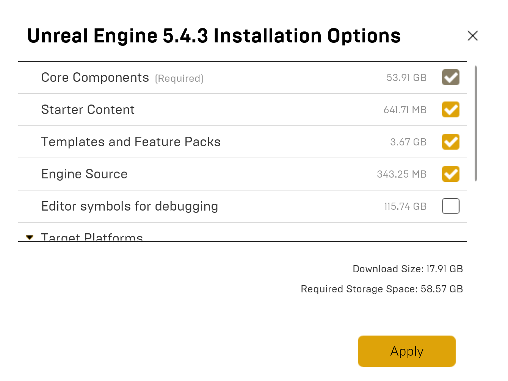

# 1. アカウント作成

下記urlからページ右上に、「サインイン」ボタンがあるので手順に沿ってアカウントの作成をお願いします

<a href="https://www.unrealengine.com/ja" target="_blank">https://www.unrealengine.com/ja</a>

 

# 2. Epic Games Launcher

UnityでのUnity Hubと同様　UEアプリを管理するEpicGamesLauncherをインストール
(UnityでいうところのAssetStoreも入ってる)

<a href="https://www.unrealengine.com/ja/download" target="_blank">https://www.unrealengine.com/ja/download</a>

まずはランチャーをダウンロードしてください

 

# 3. Unreal Engineのインストール

Unityでもやりましたね。UnrealEngineのアプリを落とす感じです。

「UnrealEngine」をクリック　→ 「ライブラリ」をクリック

 

「＋」をクリック

 

「▼」をクリックし、ver　を選択　→ 「インストール」をクリック

 

インストールする場所を決め、「オプション」をクリック

 

必要なものにチェックをつけて適用し、インストール

 

「Install」部分が「起動(Launch)」に変わったら完了

 
