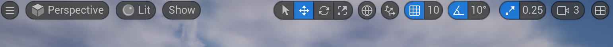

# 1.プロジェクト作成

①
②
③
④
⑤
⑥

 

何かしら初期画面が立ち上げれば成功

 

保存して再度立ち上げる時は、

 

もしくはFolderから「.uprojectをクリック」

 

UIに関しては基本的にはUnityと一緒（Unityの方が操作しやすいかもやけど）

複数のWindowがいっしょくたに集まってる

画面が違うかもしれませんが、ひとまず見て行きましょう

 

 

## 1. ビューポート

unityで言うところの「Scene Window」

 

## 2. アウトライナー

矢印　　ギズモ

 

## 3. 詳細 

 

# 4. コンテンツブラウザ

 

[Window]から[Load ~ ]で
独自のレイアウトの保存やレイアウトの読み込みもできる

 

# ビューポート、カメラ操作方法

マウスホイールを回す（前進後進）

マウスホイールをクリックしたままマウスを動かす（上下左右）（パン）

左クリック＋マウスを上下に動かす（前進後進）
左クリック＋マウスを左右に動かす（軸を固定したまま回転）

右クリック＋マウスを動かす（軸を固定したまま回転）

右クリック（ミドルボタン）＋A（左移動）
右クリック（ミドルボタン）＋D（右移動）

右クリック（ミドルボタン）＋W（前進）
右クリック（ミドルボタン）＋S（後進）

右クリック（ミドルボタン）＋Q（下移動）
右クリック（ミドルボタン）＋E（上移動）

 

カメラスピード

 

# アセット

コンテンツブラウザ上で管理するゲームで使用する素材

「Contents/Characters/Mannequins/」以下にある
初期コンテンツのアセット(フォルダ)例

+ Meshes　：　キャラクターの形状や
+ Animations　：　
+ Materials　：　
+ Textures　：　

 

# レベル

Unityで言うところの「Scene ファイル」
マップやステージのことで、配置可能なアセットをレベル上に配置していくことでゲームの3Dシーンを作って行きます

 

# アクター

レベル上に配置可能なオブジェクト(クラス)のことをアクターと呼びます

Unityで言うところのGameObjectです。

「位置」・「角度」・「スケール」のトランスフォーム情報を持っている

Unityなどとは座標系は同じだが、  
xが前　方向
zが上　方向

もちろん、Unityと一緒でゲーム中見えないオブジェクトのこともアクターと言います。

 

#　コンポーネント

コンポーネントには大きく分けて2種類あります。

+ トランスフォーム情報を持っている「Scene Component」を継承した　コンポーネント
+ トランスフォーム情報を持っていない「Actor Component」を継承した　コンポーネント

線よりした

(Scene ComponentはActor Componentを継承してトランスフォーム情報を追加したコンポーネント)

アクター（Actor）

定義: アクターはUnreal Engineにおけるゲームオブジェクトの基本単位です。プレイヤー、敵キャラクター、アイテムなど、ゲーム内のほとんどのオブジェクトはアクターとして表現されます。

トランスフォーム情報: アクターは必ずトランスフォーム情報（位置、回転、スケール）を持っています。これは、アクターがワールド空間内でどこに存在し、どのように配置されているかを示すために必要です。

アクターコンポーネント（Actor Component）

定義: アクターコンポーネントはアクターに追加される機能や特性の部品です。例えば、サウンドコンポーネント、物理コンポーネント、レンダーメッシュコンポーネントなどがあります。

トランスフォーム情報: アクターコンポーネントそのものはトランスフォーム情報を持っていませんが、特定のサブタイプのコンポーネント（シーンコンポーネント）はトランスフォーム情報を持っています。

シーンコンポーネント（Scene Component）

定義: シーンコンポーネントはアクターコンポーネントの一種であり、トランスフォーム情報を持つコンポーネントです。これにより、メッシュ、カメラ、ライトなどの位置、回転、スケールを設定できます。

トランスフォーム情報: シーンコンポーネントは、アクターのトランスフォームに対して相対的な位置、回転、スケールを持っています。

アクターはゲーム内のオブジェクトの基本単位：

「アクターはゲームの中でキャラクターやアイテム、建物などのオブジェクトを表現する基本的な単位です。アクターは、ゲームの世界における位置や回転、スケールといったトランスフォーム情報を必ず持っています。」

アクターコンポーネントはアクターに追加される部品：

「アクターコンポーネントはアクターに機能や特性を追加する部品のようなものです。アクターコンポーネント自体はトランスフォーム情報を持ちません。」

シーンコンポーネントはトランスフォーム情報を持つ特別なコンポーネント：

「シーンコンポーネントは、アクターコンポーネントの一種で、トランスフォーム情報を持つ特別な部品です。例えば、メッシュやカメラ、ライトなどはシーンコンポーネントであり、これらは位置や回転、スケールを設定できます。」

例え：車とそのパーツ
アクター = 車

アクターは、車全体に例えることができます。車は一つのオブジェクトとして、どこに停まっているのか（位置）、どの方向を向いているのか（回転）、そして車のサイズ（スケール）といった情報を持っています。
アクターコンポーネント = 車のパーツ

アクターコンポーネントは、車の中にあるエンジン、タイヤ、シートなどのパーツに例えられます。これらのパーツは、車全体の位置や回転、スケールとは関係なく、車内で特定の役割を持っています。
シーンコンポーネント = 車内の座席やハンドル

シーンコンポーネントは、車内の座席やハンドルなどの特定のパーツです。これらは車の中でどこに配置されているのか、どの向きに取り付けられているのかといった位置や回転の情報を持っています。
例えば、運転席（シーンコンポーネント）は車全体の位置とは関係なく、車内で特定の位置にあります。
授業での説明
スライド1：アクター（車）
「アクターは車全体です。車には住所（位置）、どちらを向いているか（回転）、車の大きさ（スケール）といった情報があります。」
スライド2：アクターコンポーネント（車のパーツ）
「アクターコンポーネントは車のパーツのようなものです。エンジンやタイヤ、シートなど、それぞれのパーツは車に機能を追加しますが、パーツ自体は車全体の位置や回転、スケールの情報を持っていません。」
スライド3：シーンコンポーネント（車内の座席やハンドル）
「シーンコンポーネントは、車内の座席やハンドルのような特定のパーツです。これらのパーツは車の中でどこに配置されているか、どの向きに取り付けられているかといった位置や回転の情報を持っています。」

CharacterMovementのように線より下に配置されているコンポーネントはトランスフォーム情報をもたない

 

