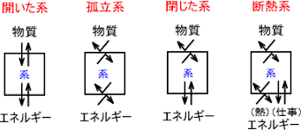
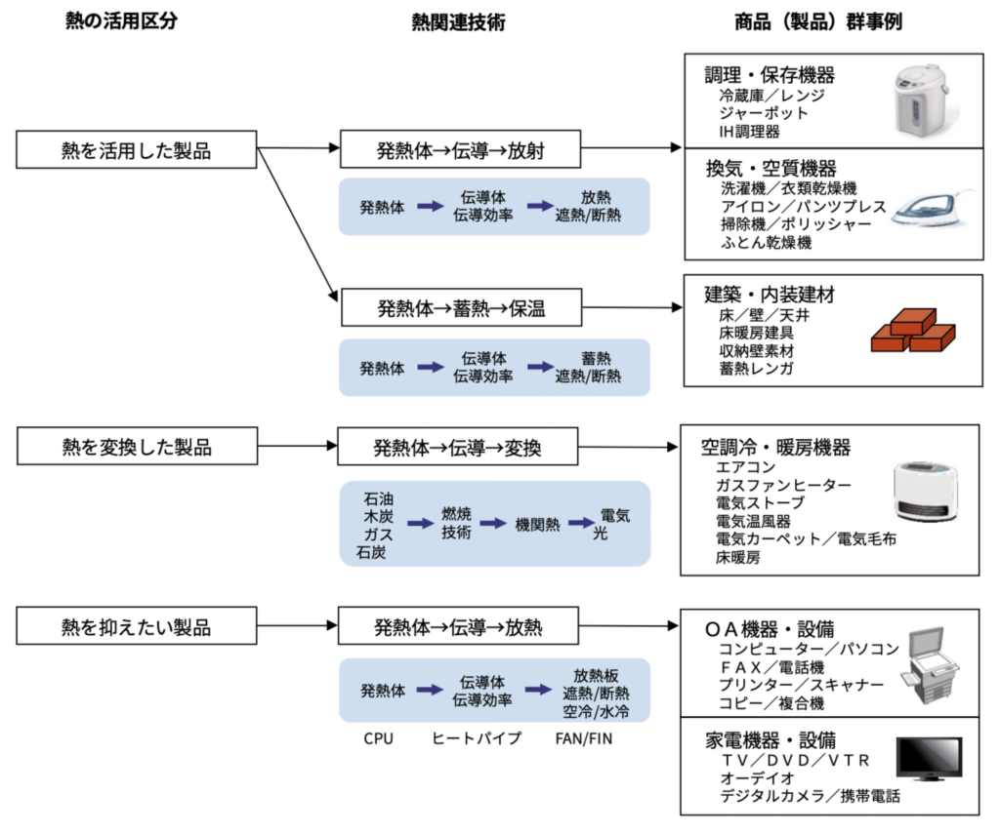
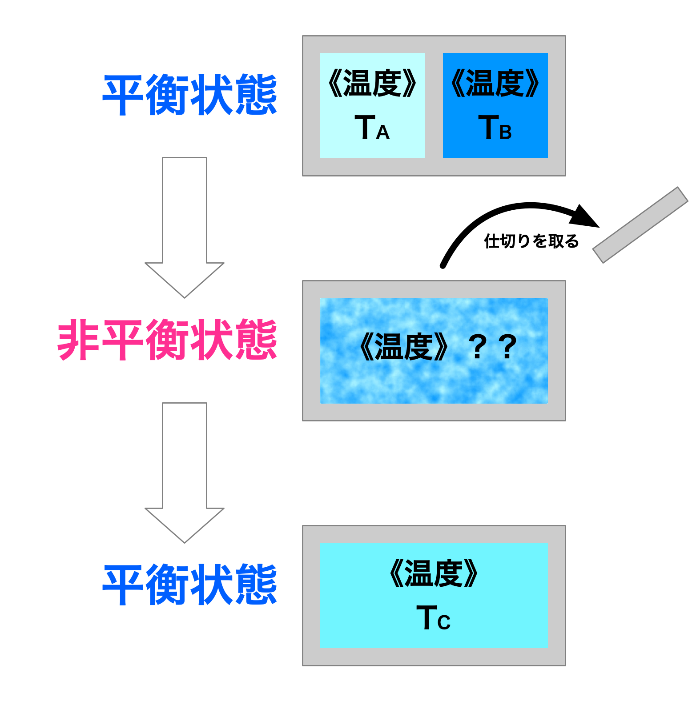
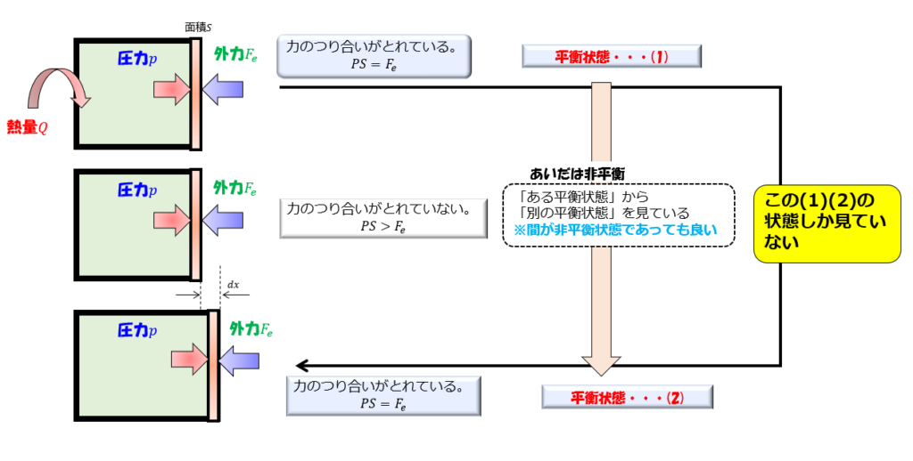
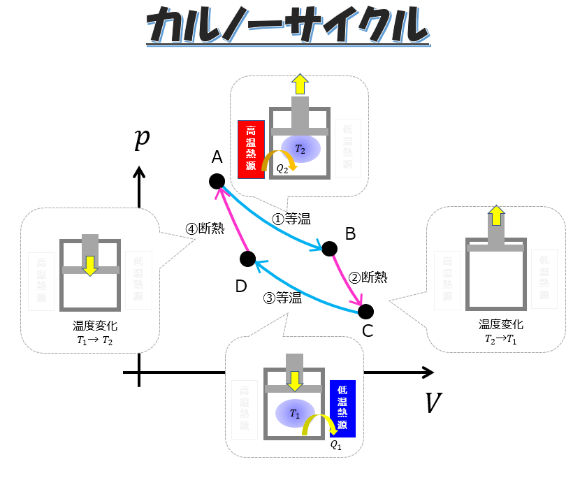
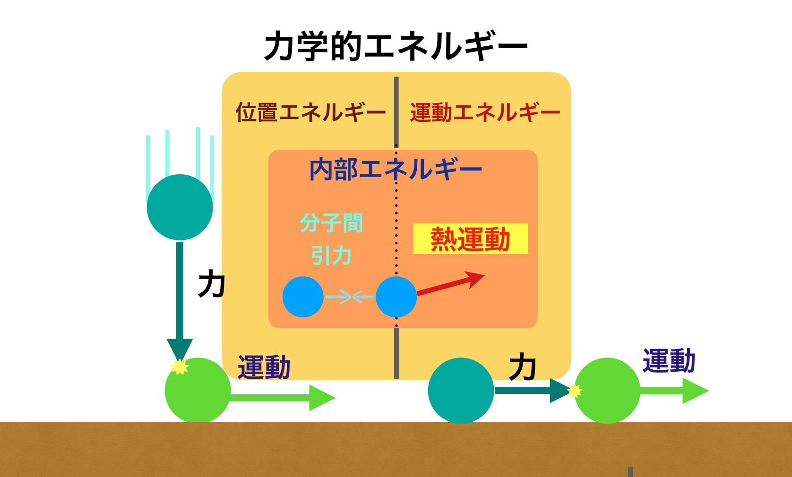
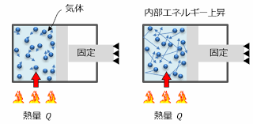

# **熱力学の基本概念**

熱力学は、エネルギー変換とその平衡状態について扱う学問です。  

化学反応や物理現象、工学的なエネルギー変換（エンジンや冷却装置など）の理解に欠かせない基礎を築きます。

ここでは、基本的な概念を体系的に説明します。

---

## **1. 系と周囲**
熱力学では「系」と「周囲」を定義して、エネルギーや物質のやり取りを考えます。

- **系（System）**: 
我々が観察・解析の対象とする部分。

  - **閉鎖系**:   
  物質の出入りがないが、エネルギーの出入りは可能。
  
  - **開放系**:   
  物質とエネルギーの両方が出入り可能。

  - **孤立系**:   
  物質もエネルギーも出入りしない完全に閉じた系。

 

- **周囲（Surroundings）**:   
系を取り巻く外部環境。

- **境界（Boundary）**:   
系と周囲を区切る面。固定されている場合もあれば、可動的な場合もある。

 

「系」と「周囲」の概念について

 

### 熱力学における「系」と「周囲」

熱力学では、観察や分析の対象となる部分を「系（システム）」と呼び、それ以外の全てを「周囲」と定義します。

この区別は、エネルギーや物質の移動を理解し、分析するために非常に重要です。

#### ・系（システム）

- 系とは、熱力学的な検討の対象となる空間や物質の集合体です。
- 例えば、エンジン、化学反応器、または単に一定量の気体などが系となり得ます。

#### ・周囲

- 周囲とは、系以外の全てを指します。
- 系と相互作用する可能性のある環境全体を含みます。

 

### 系と周囲の相互作用

系と周囲の間では、以下のような相互作用が発生します：

1. エネルギーの移動
   - 熱の形式（熱伝導、対流、放射）
   - 仕事の形式（機械的仕事、電気的仕事など）

2. 物質の移動
   - 開放系の場合、系と周囲の間で物質の出入りがあります。

## 系の分類

系は、周囲との相互作用の性質によって以下のように分類されます：

1. 孤立系：周囲とエネルギーも物質も交換しない系
2. 閉鎖系：周囲とエネルギーは交換するが、物質は交換しない系
3. 開放系：周囲とエネルギーも物質も交換する系

 

 

 

---

 

 

## **2. 状態量と平衡状態**
- **状態量（State Variable）**:
  系の状態を表す物理量で、以下のようなものがあります。
  - **圧力 (P)**:     
  単位面積あたりの力（Paやatm）。

  - **温度 (T)**:      
  系の熱的な状態を表す指標（Kや°C）。

  - **体積 (V)**:   
  系が占める空間の大きさ（m³）。

  - **内部エネルギー (U)**:   系の分子運動や相互作用に基づくエネルギー（J）。

- **平衡状態**:
  系が時間とともに変化せず、全ての状態量が一定の値を保っている状態。
  - **熱平衡**:   
  温度が系全体で一定。

  - **機械的平衡**:   
  圧力が系全体で一定。

  - **化学平衡**:   
  系内の化学反応が停止または平衡状態にある。

 

 

 

---

 

 

## **3. 熱力学的過程とプロセス**
系が一つの状態から別の状態に変化する過程を **熱力学的過程** と呼びます。代表的なものは以下の通りです：

- **等温過程**: 
温度が一定 (ΔT = 0)。

- **断熱過程**: 
系が熱を出し入れしない (Q = 0)。

- **等圧過程**: 
圧力が一定 (ΔP = 0)。

- **等積過程**: 
体積が一定 (ΔV = 0)。

 

 

この過程には様々な種類があり、それぞれ特徴があります。

### 熱力学的過程の種類

1. 緩和過程
   - 環境や拘束の変化により、系が新たな熱平衡状態に達するまでの過程です。
   - 一般に不可逆過程です。

2. 可逆過程
   - 系の状態を元に戻し、外界に変化を残さない過程です[1]。
   - 理想的な過程で、実際には完全な可逆過程は存在しません。

3. 不可逆過程
   - エントロピーが増大する過程です[2]。
   - 例えば、摩擦による発熱を含む過程などが該当します。

4. 準静的過程
   - 系の環境や拘束をごくゆっくりと変化させ、熱平衡状態に限りなく近い状態を連続的につなぐ過程です[1]。

 

 

### p-Vグラフと熱力学的過程

p-Vグラフは熱力学的過程を視覚的に表現する重要なツールです。

- グラフ上の点は気体の状態を表します。
- 異なる過程（等温変化、定圧変化、定積変化など）は、グラフ上で特徴的な曲線として表されます。
- グラフの面積は気体がした仕事やされた仕事を表します。

熱力学的過程を理解することで、系の状態変化やエネルギーの移動を詳細に分析することができます。

これは、熱機関の効率や自然現象の理解に不可欠な知識となります。

 

 

---

 

 

## **4. 熱力学系のエネルギー分類**
熱力学系のエネルギー分類には、主に以下の3つの重要な量があります：

1. **内部エネルギー (U)**:
   - 系内の分子運動エネルギーや分子間相互作用によるエネルギー。  
   - 物質を構成する分子の運動エネルギーと位置エネルギーの総和
   - [状態量](1_状態量.md)であり、系の状態が決まれば一義的に決まります

 

2. **仕事 (W)**:
   - 系が外部に対して行うエネルギーの移動、または外部から受ける仕事を表します。
   - （例: ピストンの動き）気体の膨張や圧縮による仕事などが該当します
   - $ W = P \Delta V $（可逆過程における仕事）

3. **熱 (Q)**:
   系と周囲との間で温度差によって移動するエネルギー。
   - 系が周囲から熱を受け取れば $ Q > 0 $。
   - 系が周囲に熱を放出すれば $ Q < 0 $。

 

これらU・W・Qの量は、熱力学第一法則において以下の関係式で結びつけられます：

$$ Q = \Delta U + W $$

この式は、系に加えられた熱量 Q が、内部エネルギーの変化 ΔU と系が行った仕事 W の和に等しいことを示しています。

これらの量を理解し、適切に扱うことで、熱力学系におけるエネルギーの変換や移動を定量的に分析することができます。

 

---

 

## **5. マクロな視点とミクロな視点**
マクロ熱力学とミクロ熱力学という区分があります。これらは熱力学現象を異なる視点から捉えるアプローチです。

- **マクロ熱力学**:  
マクロ熱力学は、巨視的な視点から熱力学現象を扱います
  - 全体的な観点でエネルギーや物質の流れを扱います。    
  - 状態量を直接扱い、分子レベルの詳細を考えません。 

  - 大量の粒子（アボガドロ数程度）の集団を一つのシステムとして扱います。
  - 温度、圧力、体積などの巨視的な物理量を用いて系を記述します。
  - 日常的に観測可能な現象を対象とします。
  - 原子や分子の個々の挙動は考慮しません。 

- **ミクロ熱力学（統計熱力学）**:  
ミクロ熱力学は、微視的な視点から熱力学現象を理解しようとするアプローチです。
  - 分子や原子レベルでの振る舞いからマクロな性質を導きます。
  - 個々の原子や分子の挙動に注目します。
  - 統計力学の手法を用いて、ミクロな挙動からマクロな現象を説明します。
  - 気体分子運動論などがこの分野に含まれます。

### 両者の関係

マクロ熱力学とミクロ熱力学は互いに関連していますが、熱力学の基本的な理論はマクロな視点で構築されています。  
統計力学は、これらのミクロとマクロの視点を結びつける役割を果たしています。

熱力学を学習する際は、マクロな視点を重視し、ミクロな考えを持ち込まないことが重要です。  
これにより、熱力学の美しさと普遍性が保たれています。

 

---

 

## **例題で理解を深めよう**
**例題1: 系と周囲の分類**
- シリンダー内でピストンが動くガスを考えます。
  - 系: シリンダー内のガス。
  - 境界: シリンダーの壁。
  - 周囲: シリンダーの外側。
  - ガスが膨張する場合の仕事を計算せよ。

**例題2: 状態量の計算**
- 状態方程式 \( PV = nRT \) を用いて、以下の条件で系の体積を求めよ。
  - 圧力: 1 atm
  - 温度: 300 K
  - モル数: 1 mol

 

---

 

**例題1: 系と周囲の分類**

シリンダー内のガスを熱力学系として考える場合、以下のように定義できます：

- 系：シリンダー内のガス
- 境界：シリンダーの壁
- 周囲：シリンダーの外側

ガスが膨張する場合の仕事を計算するには、以下の手順を踏みます：

1. ガスの膨張過程を定義する（等温、断熱、その他）
2. 適切な熱力学的関係式を使用する
3. 初期状態と最終状態を考慮する

ここでは、最も一般的な等温膨張の場合を考えます。

## 等温膨張における仕事の計算

等温膨張では、温度が一定に保たれながらガスが膨張します。この場合、仕事 W は以下の式で表されます：

$$ W = nRT \ln\left(\frac{V_2}{V_1}\right) $$

ここで、
- n：ガスのモル数
- R：気体定数 (8.314 J/(mol·K))
- T：絶対温度 (K)
- V₁：初期体積
- V₂：最終体積

例えば、1 モルの理想気体が 300 K の温度で、初期体積 1 L から 2 L に膨張した場合：

$$ W = (1 \text{ mol})(8.314 \text{ J/(mol}\cdot\text{K)})(300 \text{ K}) \ln\left(\frac{2 \text{ L}}{1 \text{ L}}\right) $$

$$ W \approx 1730 \text{ J} $$

この計算結果は、ガスが膨張する際に周囲に対して約 1730 J の仕事を行ったことを示しています。

注意点：
- この計算は理想気体を仮定しています。
- 実際のエンジンサイクルでは、より複雑な過程が含まれます。
- 正確な計算には、具体的な初期条件と最終条件が必要です。

 

---

 

**例題2: 状態量の計算**

理想気体の状態方程式 PV = nRT を使って、与えられた条件から体積を求めましょう。

まず、与えられた条件を整理します：

- 圧力 (P): 1 atm
- 温度 (T): 300 K
- モル数 (n): 1 mol
- 気体定数 (R): 0.08206 L·atm/(mol·K)

注意: 気体定数Rの値は、圧力の単位がatmで体積の単位がLの場合の値を使用しています。

次に、PV = nRT の式を変形して体積Vについて解きます：

V = nRT / P

この式に値を代入します：

V = (1 mol) * (0.08206 L·atm/(mol·K)) * (300 K) / (1 atm)

計算すると：

V ≈ 24.618 L

したがって、与えられた条件下での系の体積は約24.618リットル、または約24.62リットルとなります。

この結果は、標準状態（0°C, 1 atm）での1モルの気体の体積が約22.4リットルであることを考えると、妥当な値であることがわかります。  
温度が高くなると体積も増加するため、300 K（約27°C）では22.4リットルよりも大きな値になっています。

 

---

 

この講義では、基本概念を丁寧に説明しつつ、例題を解きながら理解を深めていきます。
次回は「熱力学第1法則」に進み、エネルギー保存の考え方を詳しく見ていきましょう！